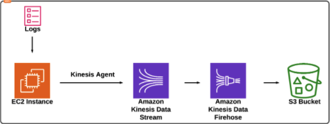
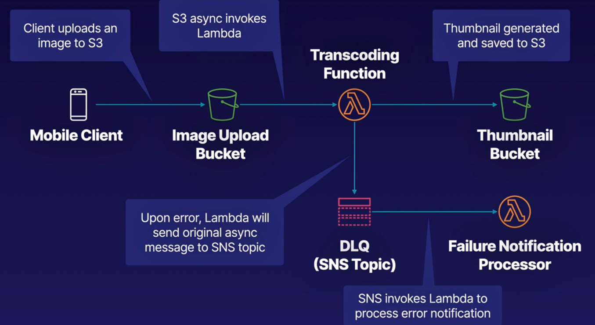
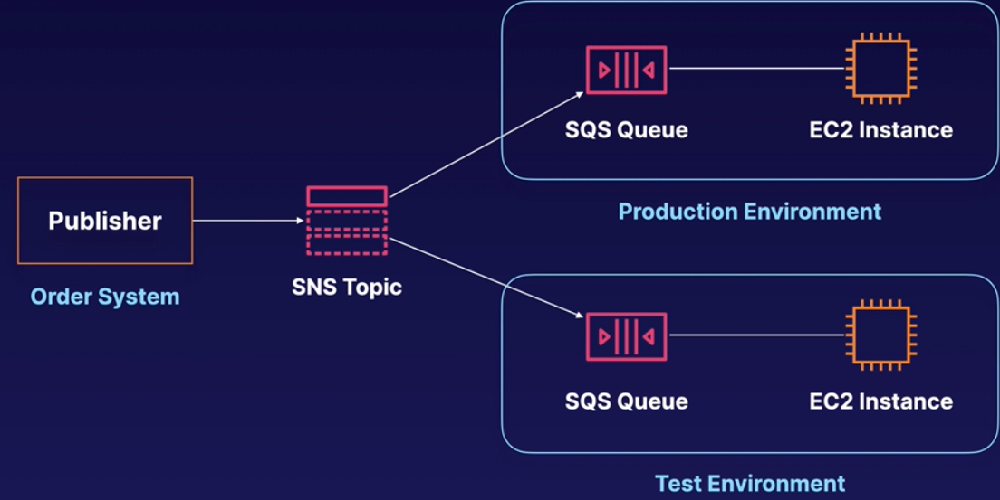

### SQS - Simple Queue Service
- *first amazon service*
- **helps to decouple components of application to run independently**
- web service to access a message queue to store messages
- **distributed queue system**
- web apps can quickly and reliably produce and consume messages
- **pull based, not push based**
- **messages can contain upto 256 KB of text**
- message of bigger size will be stored in S3
- but SQS will still have handle to those messages
- **message can be consumed using SQS API**
- acts as buffer between producer and consumer
- **default retention period is 4 days**
- **but allows messages to be in queue from min 1 to 14 days**
- 2 types of queues - standard and FIFO queues
    - **Standard queue**
        - this is the default type
        - **allows nearly unlimited transactions per second**
        - **follows at-least once delivery semantics normally**
        - **order is not guaranteed**
        - **sometimes due to distributed architecture, messages can be delivered more than once**
        - messages are en-queued and de-queued in the same order generally
    - **FIFO queue**
        - **guarantees exactly once delivery semantics**
        - **ordering of messages is strictly preserved**
        - **duplicate messages are not allowed**
        - limited to 300 transactions per second
        - **not as fast as standard queue**
        - supports message groups
        - allows multiple ordered groups in single queue
        - *name of FIFO queue must end with .fifo suffix*
- **visibility time out**
    - amount of time message is invisible from the queue after the consumer picks it up
    - if message is processed within timeout, then it is deleted
    - if message is not processed within timeout, it becomes visible again and a consumer can pick it up
    - this results in same message delivered more than once
    - **timeout max value is 12 hrs**
- **long polling can be used to retrieve messages, if consumer has to wait for long time for messages**
- **you cannot convert standard queue into FIFO or vice versa after creation**

### SWF - Simple WorkFlow Service
- **web service to coordinate work across distributed application components**
- use cases are media processing, business process workflows, analytics pipelines
- basically used to coordinate tasks which contains multiple processing steps
- **usually used in cases where there is human interaction**
- **workflow and activity types should be grouped in a DOMAIN**
- **SWF executions can last up to 1 year**
- **SWF has task oriented api but SQS has a message oriented api**
- **SWF ensures task is assigned only once unlike standard SQS**
- **SWF tracks all the tasks of an application, unlike SQS where you need to implement tracking**
- actors
    - workflow starters - application that starts the workflow - like a web form
    - deciders - controls the activity task flow in the workflow, also decides next tasks
    - activity workers - carry out the actual tasks

### SNS - Simple Notification Service
- web service used to set up, operate and send notifications from the cloud
- **instantaneous, push based delivery**
- **inexpensive, pay-as-you-go with no upfront costs**
- message delivery supports multiple protocols
- highly scalable and cost effective way to publish messages
- **supports push notifications , sms**
- can also send text or email to SQS or to any http endpoint
- **can group multiple recipients using topics**
- recipients can subscribe to such access points
- one topic can support multiple end point types - like ios, android and sms recipients
- SNS can send appropriately formatted message to each subscriber type
- **SNS messages are stored redundantly in multiple AZs for availability**
- can be managed using aws console

### Elastic Transcoder
- media transcoder in the cloud
- convert media from original format to different formats needed by different devices like phone, PCs etc
- provides settings for popular output formats like ios, android etc
- **pay based on minutes to transcode and also the resolution**

### API Gateway
- **service to publish, maintain, monitor and secure APIs at scale**
- front door for apps to access backend services like EC2, lambda, dynamo db etc
- **low cost, scales automatically**
- expose https endpoints for defining REST api
- connects to lambda and dynamodb in a serverless way
- can route each endpoint to a different target
- can track usage using API key
- can throttle requests
- can connect to CloudWatch to log all requests for monitoring
- can maintain different version of API
- **how to configure an gateway**
    - define an API (container)
    - define resources (URL paths)
    - select supported http methods
    - configure security
    - choose target behind endpoint - lambda, ec2, dynamodb etc
    - **set request and response transformations**
- **how to deploy**
    - uses api gateway domain by default
    - can also use custom domain
    - supports aws certificate manager for free ssl/tls certs
- **api caching**
    - cache endpoint response
    - can set TTL in seconds
- **same origin policy**
    - is a web app security model
    - **browser allows scripts in one page to access another page only if both pages have same origin**
    - browsers enforce by default
    - postman, curl DO NOT enforce this
- supports prevention of cross site scripting attacks
- **CORS - cross origin resource sharing**
    - enforced by client - web browser
    - in this case the server relaxes the same origin policy
    - this allows resources like fonts to be shared between web pages across domains
    - for this to work, CORS has to be enabled on API gateway
    - **Error - Origin Policy cannot be read at the remote resource**
    - **if you see this error, it means CORS is not enabled in API gateway**

### Kinesis 101
- a platform in aws to send your streaming data to
- Streaming data
    - data generated continuously from multiple sources
    - sent simultaneously in small chunks (KBs)
    - like stock price, gaming data, geospatial data(uber), social networking data, IOT data etc
- can load and analyze incoming data
- 3 types
    - **kinesis data streams**
        - **persistent storage consists of shards**
        - retention period 24 hrs to 7 days
        - **different shards for different sources of data**
        - ec2 can connect to these shards and consume the data and process them
        - processed data can be stored in dynamodb, s3, redshift etc
        - **data capacity of the stream is the sum of the capacities of its shards**
        - **key components - delivery streams, data record, destinations**
        - **pricing of the data streams is on a per-shard basis**
    - **kinesis data firehose - S3**
        - **no persistent storage**
        - data has to be processed in memory
        - load streaming data into data stores and analytics tools
        - lambda functions can be used to consume and process the data
        - processed data can be stored in S3 and redshift (not directly)
        - **key components : delivery streams, records of data, destinations**
    - **kinesis analytics**
        - **works with both stream and firehose**
        - can process data on the fly using either stream or firehose
        - processed data can be stored in s3, redshift or elasticsearch cluster
    - 

### Event Processing Patterns
- Pub/Sub messaging - decouple systems
- **Dead Letter Queue (DLQ)**
    - stores unclaimed messages
    - **supported by SQS, SNS, Lambda**
    - like a catch all for message if app-related error handling has been exhausted
    - SNS - if message to a topic fail, then it is sent to SQS queue, which acts as DLQ
    - SQS - if message exceeds **maxReceiveCount**, it is sent to DLQ which is another SQS queue
    - Lambda - if invocation fails, failed result is sent to SQS or SNS
      
- **Fanout pattern**
    - can be used when message needs to be published to multiple downstreams
    - **facilitated by SNS**
    - instead of sending messages individually to each downstream, publisher can send message to SNS topic which can be listened by downstream SQS queues
    - messages can also be sent to test environment for further analysis
      
- **S3 Event Notifications**
    - used to notify when certain events occur in the S3 bucket
    - notifications can be sent to SQS, SNS, Lambda
    - filters can be placed on when notification occurs - e.g. certain type of objects in S3
    - **for more reliability in notification, versioning can be enabled in S3**
    - **e.g of events that can trigger notification**
        - Object created
        - object removed - both versioned and un-versioned objects
        - object restored
        - when object is lost in Reduced Redundancy Storage
        - when replication fails, or exceeds time limits etc

### AWS ParallelCluster
- used in ML / HPC
- **self served, NOT fully managed**

### AWS SageMaker
- used in ML / HPC
- **fully managed service**
