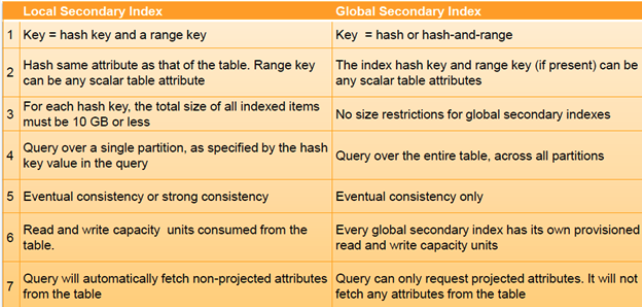
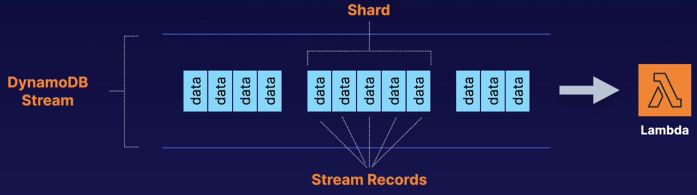
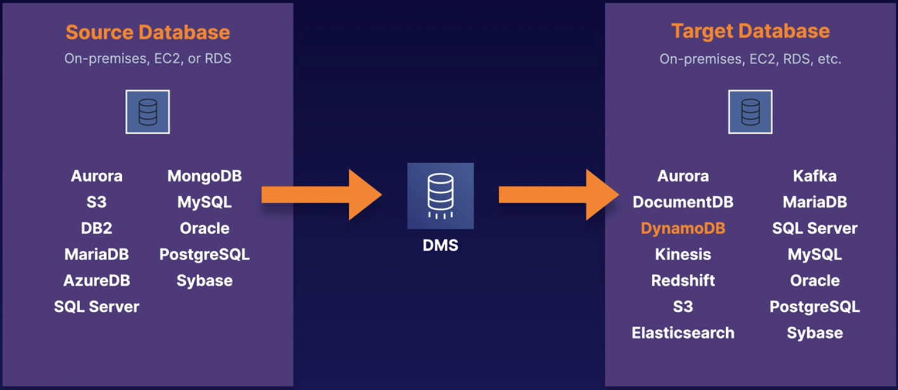
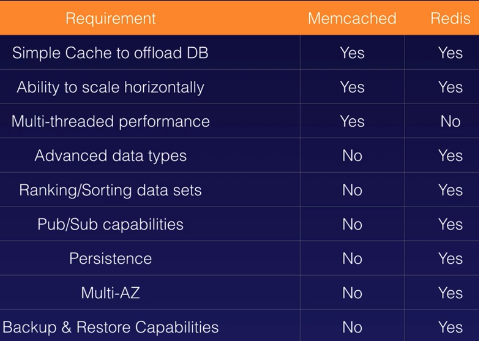
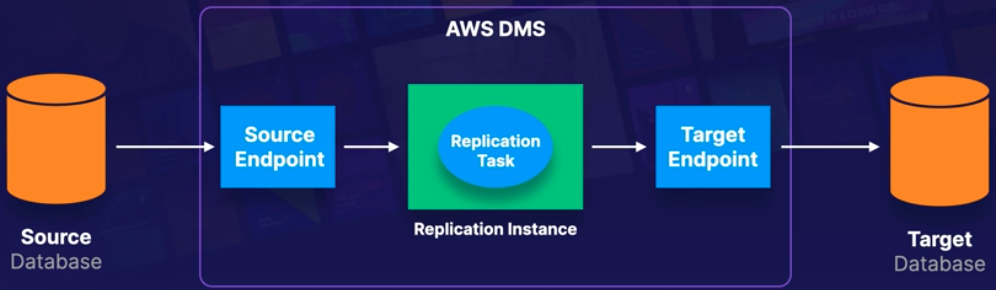
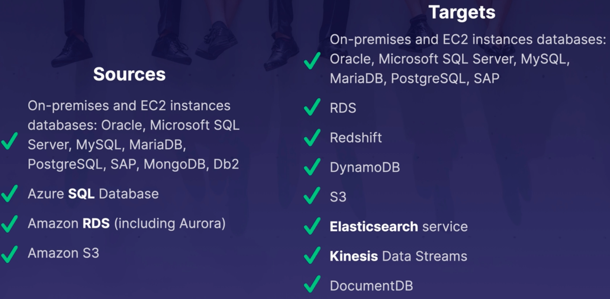
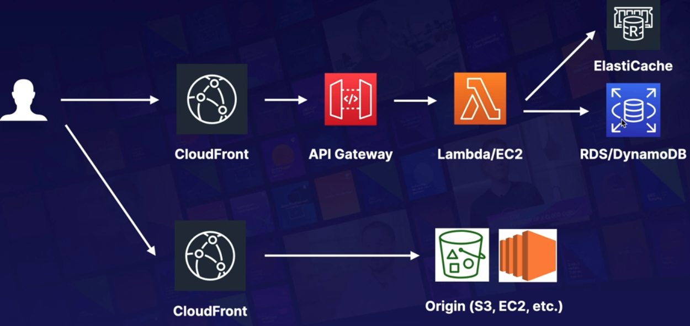

# Databases

### Relational Database Services (RDS)
- **runs on virtual machines**
- **you cannot login (ssh) into your rds instances**
- updating RDS machines in amazon's responsibility
- **it is not serverless - exception is Amazon Aurora which is serverless**
- **6 OLTP dbs supported = mssql, oracle, mysql, postgres, aurora(amazon), mariadb**
- **2 features**
  - **multi AZ - for DR - has auto failover**
  - **read replicas - for performance - no automatic failover**
- **non rdbms**
  - collection -> table
  - document -> row
  - key values -> columns (fields) -> this is flexible
- Redshift - Amazon's data warehousing service for running OLAP kind of processing
- Elasticache - scalable in-memory cache - supports memcached and redis
- when connecting an EC2 instance to RDS, make sure that the app server instance running on EC2 is able to access the DB port
- for this to work, add a new inbound rule in the DB security group to allow web server to connect to DB via the specified port - e.g for mysql allow port 3306 to be accessible
- **max storage for mssql rds is 16TB when using the Provisioned IOPS and General Purpose (SSD) storage types**
- sample user-data script to install php, wordpress on ec2 and connect to mysql db on RDS

```
#!/bin/bash
sudo su
amazon-linux-extras install epel
amazon-linux-extras install php7.2
yum install httpd -y
cd /var/www/html
wget https://wordpress.org/latest.tar.gz
tar -xzf latest.tar.gz
cp -r wordpress/* /var/www/html
rm -rf wordpress
rm -rf latest.tar.gz
chmod -R 755 wp-content
chown -R apache:apache wp-content
chkconfig httpd on
service httpd start
```

**Backups**
- automated backups
  - allows you to recover db to any point in time within a retention period
  - retention period is between 1 and 35 days
  - takes full daily snapshot and also stores transaction logs throughout the day
  - when you want to recover, you take the most recent snapshot and apply transaction logs for that day
  - so you can recover to a point in time to a second
  - **enabled by default**
  - back up is stored in S3 and storage is free equal to the size of your db
  - backups are done during a time window - during this window, storage I/O may be suspended and latency may be little high
  - **backups are deleted when the original db is deleted**
- db snapshots
  - **snapshots are done manually - usually user initiated**
  - **snapshots are retained even if the original RDS instance is deleted**
- restoring backups
  - **when you restore either from automated or snapshot, it is restored as a new version of the db with a new DNS endpoint**
- encryption
  - encryption at rest is support for all supported db types
  - AWS KMS is used to encrypt
  - **once RDS instance is encrypted, data at rest, backed up data, read replicas, snapshots are all encrypted**

**Multi-AZ**
- all changes are **synchronously** replicated to the alternate instance in another AZ
- aws handles the replication
- **during outage or maintenance, RDS automatically fails over to the standby instance**
- **standby instance is not accessible during normal operation**
- **DNS will remain the same**
- **is used for DR only, not for performance improvement**
- available for mssql, oracle, mysql, postgresql, mariadb
- aurora by design is fault tolerant
- **to force a failover to a different AZ, the instance should be rebooted**
- **to enable AZ, minimum of 2 AZs should be present in DB subnet group when launching**
- **data transfer is NOT charged when replicating between AZ when multi-AZ is enabled**
- reasons for failover
  - host failure
  - db instance class modification
  - instance rebooting
  - AZ failure
  - RDS maintenance

**Read replicas**
  - data is **asynchronously** replicated from main db to the read replicas
  - **helps improve performance by using read replicas for all read operations**
  - **can be enabled only when backup is configured**
  - you can have read replicas of read-replicas - could result in latency issues
  - generally used for read heavy database workloads
  - available for mssql, postgresql, mariadb, aurora. **sqlserver not supported**
  - **used for scaling, not for DR**
  - **must turn on automatic backs ups**
  - can have upto 5 replicas
  - can be either aurora or mysql replicas
  - when you have read replicas of read replicas, latency may become an issue
  - **each read replica will have a separate DNS endpoint**
  - **read replicas can be multi AZ - can also be in a different region**
  - **read replicas can be promoted to their own db - in this case, replication breaks**
  - **read replica can be in a second region**

### Dynamo DB (Not relational - Nosql)
- **Primer**
    - **Items** - row of data in a table
    - **Attributes** - column of data in a table
    - Supports key-value and document data structures
    - **Key** - the name of the data
    - **Value** - the data itself
    - **Document can be written in JSON, HTML or XML**
    - **Primary Keys**
        - stores and retrieves data based on a Primary key
        - uses Partition keys to determine the physical location data is stored
        - if partition key is Primary key, then no item will have the same Partition key
        - Composite Keys (Partition Key + Sort Key) can be used in combination
        - 2 items may have the same partition key, but must have a different sort key
        - items with same partition key are stored together and sorted by sort key value
        - can store multiple items with the same partition keys.
    - **Indexes**
    


- **amazon's nosql db**
- single digit millisecond latency
- supports both key value and document data
- fit for mobile, web, gaming, iot etc
- **stored on ssd storage**
- **spread across 3 geographically distinct data centres**
- read modes supported -
    - **eventually consistent reads**
      - **this is the default mode**
      -  data will be replicated to all copies usually more than a second
      - to reads of written data after a short time will return latest data
      - but data is not instantly available across all replicas
    - **strongly consistent reads**
      - if you need latest data less than 1 sec after write then go for this approach
- **DynamoDB Accelerator (DAX)**
  - **fully managed, highly available, in-memory cache**
  - 10x perf improvement
  - response time reduces from millisecs to microsecs
  - **no need to manage the caching logic**
  - compatible with existing DynamoDB API calls
  - **can support read and write perf**
  - **write-through cache - write to DAX instead of DynamoDB directly**
  - designed for HA
  - **automatic failover in a different AZ**
- **Transactions**
  - **DyDB performs 2 underlying reads and writes**
  - one for preparing txn and other for commit
  - so this needs to be taken into account while calculating capacity
  - **upto 4MB of data can be used in a txn**
- **On-demand capacity**
  - pay per request pricing
  - when traffic goes up, DyDB can instantly ramp up to accommodate
  - no minimum capacity to purchase
  - **no charge for read/write - only for storage and backups**
  - **pay MORE per request compared to provisional capacity**
  - typically used for new products, then convert to provisional after it becomes stable
- **On-demand backup and restore**
  - full backups at any time
  - no impact on performance or availability
  - consistent within seconds and are retained till they are deleted
  - operates in same region as source table
  - **so backup and restore cannot be done across regions**
- **Point in time recovery (PITR)**
  - protects against accidental writes or deletes
  - can restore to any point upto 35 days
  - incremental backups
  - **not enabled by default**
  - **most recent restore - 5 mins in the past**
- **Streams**
  - **Time-ordered sequence of item level changes in a table**
  - like a FIFO list of changes to the table
  - consists of stream records that contains all changes to the table
  - stored for 24 hours
  - stream records contains inserts, deletes and updates to the table
  - **each table has its own stream**
  - **Structure of stream** -
    - each stream has stream records
    - each record represents a single change in the table
    - each record is assigned a sequence no
    - a group of stream records is called a Shard
    - Shard has metadata for accessing and iterating through the records
    - after 24 hours, one shard is deleted completely
    - use cases - cross region replication, messaging, notification apps
    - **combines with Lambda functions to provide stored proc like functionality**
    
- **Global tables**
  - managed multi-master, multi-region replication
  - **based on streams - so it has to be enabled**
  - for globally distributed apps
  - multi-region redundancy for DR or HA
  - replication latency < 1 sec
  - no application rewrites
- **Database Migration Service (DMS)**
  - to transfer data from one db to another
  - **source and destination both can be on-prem or aws**
  - **dynamodb cannot be used as a source db**
  
- **Security**
  - encrypted at rest using KMS
  - access can be given using -
    - site to site vpn
    - Direct connect (DX)
    - IAM policies and roles
    - Fine-grained access - control access at attributes level
    - can be monitored using CloudWatch and CloudTrail
    - VPC endpoints

### Redshift
- **amazon's data warehousing service on the cloud**
- used for business intelligence
- petabyte scale
- very less cost compared to other warehousing solutions
- used for OLAP processing
- **configurations**
  - single node - 160 GB
  - **multi node**
    - leader node - manages client connections and receives queries
    - compute node - performs queries and computations
    - up to 128 compute node under a leader node
- advanced compression
    - **redshift does column compression instead of row**
    - since column data has same datatype, compression can be more effective
    - compression ration is much more than traditional rdbms
    - **does not need indexes or materialized views - so less space usage**
    - **when loading data into an empty table, based on data, redshift decides the best compression scheme**
- massively parallel processing (MPP)
    - redshift automatically distributes data and queries across nodes
    - easy to add new nodes to the warehouse - scale out
    - so query performance remains fast even as the warehouse grows
- backups
    - **enabled by default with 1 day retention period**
    - max retention period is 35 days
    - **maintains at least 3 copies of data - one original and one replica on compute node and one backup on S3**
    - **asynchronous replication of snapshot to s3 in another region for DR**
- pricing
    - charged only for compute node, not leader node
    - billed for 1 unit per node per hour
    - so 3 node cluster running for 1 full month will be charged for 2160 (3 * 24 * 30) instance hours
    - also will be charged for backup
    - also will be charged for data transfer within the vpc
- security considerations
    - data in transit secured by SSL
    - data at rest secured using AES-256 encryption
    - redshift takes care of key management by default
    - but you can manage your own keys using HSM and/or AWS KMS
- availability
    - **currently available only in 1 AZ, no multi AZ**
    - snapshots can be restored to a new AZ during outage

### Aurora
- **amazon's mysql and postgres compatible rdbms engine**
- cheaper than mysql, more performant than mysql
- starts with 10GB, scales in 10GB increments till 64TB
- uses storage autoscaling
- compute resources can scale up to 32vCPU and 244 GB of memory
- **2 copies of data in each AZ with min of 3 AZs - total 6 copies**
- transparently handles loss of up to 2 copies of data without affecting write availability
- up to 3 copies of data without affecting read availability
- **self healing - discs are auto scanned for errors and auto corrected**
- **replicas**
    - 3 types - Aurora replicas, Mysql replicas, Postgres replicas
    - **Automated failover is available only with Aurora replicase**
    
- **backups**
    - **automated backups are enabled by default**
    - do no impact performance
    - can also take snapshots, with no impact on performance
    - **snapshots can be shared with other aws accounts**
- **Aurora Serverless**
    - **on-demand, autoscaling configuration for Aurora mysql and postgres**
    - automatically starts, scales up or down and shuts down
    - **used for infrequent, intermittent or unpredictable workloads**
- **Migrate from mysql to aurora**
  - create a aurora read replica of the mysql instance
  - then promote one of the replicas (write) to become a master
  - this will have different DNS endpoint

### Elasticache
- **web service that is easy to deploy, operate and scale in-memory cache in the cloud**
- improves db and web app performance
- **faster then disk based IO**
- supports memcached and redis
<br><br>

### Database Migration Service
- service to migrate RDBMS, data warehouses, nosql db
- can migrate data INTO AWS
- can migrate from one cloud to another - Azure to AWS
- can migrate data between On-prem instances - AWS Cloud Setup
- can migrate data between AWS and on-prem
- **how it works**
    - its a server that runs replication software
    - set up source and target connection (endpoint) and schedule
    - it creates tables and PKs automatically if don't exist
    - **target tables can be manually pre-created**
    - can also use **Schema Conversion Tool** to create target db objects
    <br><br>
- types of DMS
    - **homegoenous migration** - Oracle to Oracle
    - **heterogenous migration** - SQLServer to Aurora, **uses SCT**
- sources and targets of DMS
<br><br>

### Caching services
- services that have caching features
    - CloudFront
    - API Gateway
    - ElastiCache - Memcached and Redis
    - DynamoDB Accelerator (DAX)
- caching can be used in the above services in the below architecture
<br><br>

### Elastic Map Reduce(EMR)
- cloud based big data processing platform
- uses Apache Spark, Apache Hive, Apache HBase, Apache Flink, Apache Hudi, Presto
- can run petabyte scale data analysis
- **less than half the cost of onprem solutions**
- **3 times faster than Apache Spark**
- **components of EMR**
    - **cluster** - collection of EC2 instances
    - **node**
        - each instance in the cluster
        - each node has a role in the cluster - called node type
        - different software is installed in each node type
        - **nodes can talk to each other and also with the master**
        - **types of node**
            - **master node**
                - manages the cluster
                - tracks the status of tasks
                - monitors health of cluster
                - **every cluster has a master node**
            - **core node**
                - has software components installed
                - runs tasks and stores data in HDFS on the cluster
                - **multi-node cluster will have at least one core node**
            - **task node**
                - has software component installed
                - **only runs tasks, DOES NOT store data in HDFS**
                - **task node is optional**
- **log files back-up**
    - master node stores all the log data in **/mnt/var/log**
    - **to prevent losing log files, they can be backed-up in S3**
    - log files are archived at 5 minute intervals
    - **log file back up needs to be set up when cluster is created**
