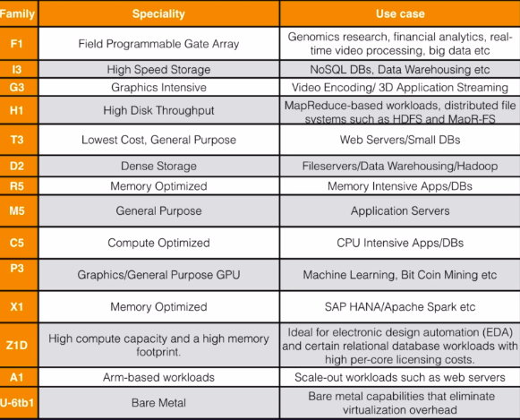
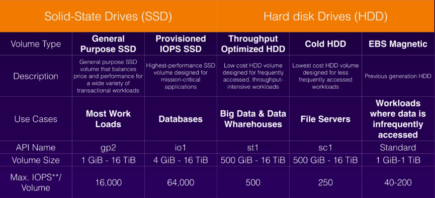
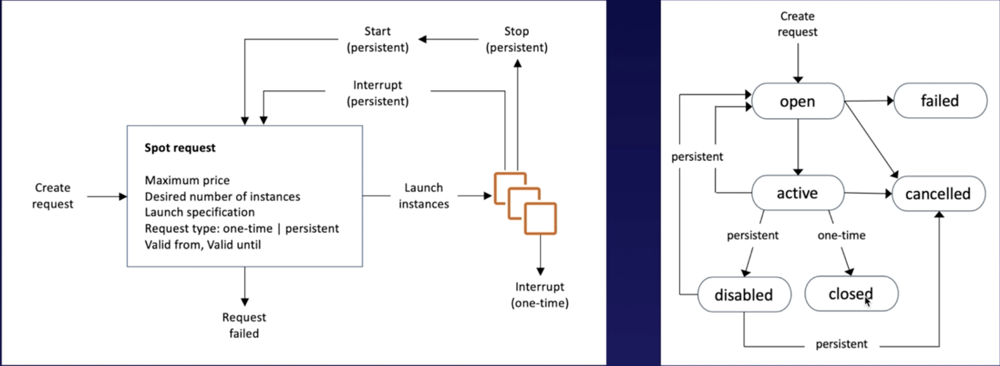

# Elastic Compute Cloud (EC2)

- webservice that provides resizable compute capacity
- can be created on shared or dedicated hosts
- **ec2 instance is provisioned in AZ (by specifying which subnet)**
- you will have root access on each instance you created
- SLA - 99.95% per region in a month
- need a key pair to access - you get private key and aws stores the public key
- **termination protection is disabled by default - need to turn it on explicitly**
- **once it is enabled, instance can be terminated only when it is disabled**
- supports 2 types of block store devices
  - **Elastic Block Store (EBS)**
    - persistent, network attached virtual drives
    - when instance is terminated, root EBS volume is terminated
    - but other volumes may not be deleted by default
    - **root volume on default AMI CAN be encrypted (earlier it could not be)**
    - additional volumes can be encrypted
  - **instance store**
    - virtual hard drive on the host allocated to an EC2 instance
    - cannot be more than 10GB per device
    - non-persistent
- ec2 instance root/boot volume can be either EBS or instance store
- status changes from in-use to available
- to ping the public ip of the instance, you need to enable ICMP (All - ICMP - IPv4) in the security group
- **when you *stop/terminate* an instance, it loses its public IP and DNS values (it is returned to the public ip pool) , but retains the private ip/dns**
- **if you *reboot the instance* then you do not lose the public ip/dns**
- **if you use elastic ip and reboot the instance, it retains the ip address**
- when you terminate the instance, you have option to release the elastic ip
- else you will incur charge for using the elastic ip
- when you restart the instance, then a new ip will be assigned


### EC2 Purchasing Options
- **on-demand**
  - fixed rate per hour or second - no commitment
  - for short term, spiky apps that cannot be interrupted
  - can be used for dev , poc kind of env
- **reserved instances**
  - reserving long term capacity and pay for it when you run
  - when you launch an on-demand instance and it matches the reserved one , then reserve pricing will apply instead of on demand
  - can purchase it at good discount, especially when paid upfront
  - purchased instances are always available
  - term options 1 or 3 yrs - not refundable - but can sell unused instance in market place only with AZ scope
  - you are billed whether instance runs or not
  - when term expires, aws renews the contract but with on-demand price
  - the scope of the instance can be either AZ or Region
  - can migrate an instance from one AZ to another AZ in a region
  - **only for EC2, not for Fargate or Lambda**
  - **types**
    - standard reserved instance - cannot be moved between regions
    - convertible reserved instance
    - schedule reserved instance
- **spot instances**
  - this is aws selling excess capacity, cheaper than on demand
  - allows customers to use instances without prior commitment
  - **only for EC2, not for Fargate or Lambda**
  - customer can bid on spot instances
  - if aws price meets the bid price, you are allocated an instance
  - when aws market price goes higher, they can just terminate the instance without notifiying
  - EBS volumes can be encrypted during launch
  - use spot  instances if apps can be interrupted - like background jobs, batch processing, data analysis etc
  - use spot to augment reserved and on demand capacity
- **dedicated hosts**
   - used for regulatory requirements when multi tenancy cannot be used
   - used to host software which has strict licensing (like oracle)
   - can be purchased on demand (hourly)
   - can be purchased as a reservation at discounted prices (70% off on- demand)

### EC2 instance types
<br>

- **Mnemonic for instance types - FIGHTDRMCPXZAU - Fight Dr McPizie Au**

### EC2 Security Groups
- **when a rule change happens in a security group, it is immediately reflected**
- e.g, if you delete http port 80 inbound rule, then your website cannot be accessed almost instantly
- security groups are stateful - means, when an inbound rule is created, an outbound rule is automatically created
- **you CANNOT block access to a port, IPs using security groups - need to use Network ACL (NACL) for that**
- **by default all inbound access is blocked and all outbound is allowed when an instance is created**
- you need to explicitly enable it using security groups
- **you can only specify allow rules, not deny rules**
- you can attach more than one security group to an instance - using Instance -> Actions -> Networking -> Change Security Group
- you can have more than once instance within a security group

### Elastic Block Store (EBS)
- persistent , network attached virtual drives
- **automatically replicated within the same AZ**
- types
  - **general purpose - gp2**
    - *SSD backed*
    - **useful for small dbs, boot volume, dev/test env, low latency apps etc**
    - size 1 TB - 16 TB (1 TB - 2^40 bytes)
    - max IOPS = 16000
  - **provisional IOPS - io1**
    - *SSD backed*
    - **used for critical apps like banking, I/O intensive SQL/NOSQL db**
    - low latency
    - size - 4 Tb to 16 Tb
    - max IOPS - 64000
  - **throughput optimized HDD - st1**
    - *HDD backed*
    - **used for streaming, big data, log processing, data warehousing**
    - **CANNOT be used as boot volume**
    - used for frequently accessed, high throughput loads
    - size 500 GB to 16 TB
  - **cold HDD - sc1**
    - *HDD backed*
    - **used for less frequently accessed loads**
    - **CANNOT be used as boot volume**
    - size - 500 GB to 16 TB
  - **magnetic HDD - standard**
    - *HDD backed*
    - **old generation**
    - for transactional loads where throughput(mb/s transfer rate)
    - used for infrequently accessed data
    - size - 1 GB to 1 TB

<br>

- **EBS volume will always be in the same AZ as the instance to which it is attached**
- **EBS volume size can be changed on the fly**
- **EBS storage type can be changed on the fly**
- EBS has 99.999% availability
- can act as both primary and secondary storage
- **primary (root volume) -**
    - created/attached during instance launch
    - **instance can have only one primary volume**
    - can be resized in future
    - cannot be detached from instance
    - **when instance is terminated, the root volume is also deleted**
- **secondary -**
    - can be attached, detached, modified at any time
    - **instance can have multiple secondary**
    - **can be detached without stopping the instance**
    - **when instance is terminated, secondary volume are not terminated**
- **snapshots**
    - can create point-in-time snapshots of EBS volumes
    - manually or automated
    - will be stored in S3 bucket
    - snapshots are incremental
    - only blocks that have changed since last snapshot will be stored in S3
    - to create a snapshot of root volume, it is recommended to stop the instance
    - **you can also take the snapshot while running**
- **AMIs -**
    - can be created both from volumes and snapshots
    - **can't delete a snapshot of the root volume used by a registered AMI**
    - **first deregister the AMI before you can delete the snapshot**
    - encrypted AMIs cannot be shared publicly
    - it is either private or selectively public (particular users)
- **to move an EC2 volume from one AZ to another -**
    - take a snapshot
    - create an AMI from the snapshot
    - launch an instance from the AMI, but in a new AZ
- **to move an EC2 volume from one region to another -**
    - take a snapshot
    - create an AMI from the snapshot
    - **copy the AMI from one region to another**
    - launch a new instance from the copied AMI
- root volume is separate from the instance - since the volume is encrypted, both data at rest and transit will be encrypted

### Instance Store
- virtual hard drive on the host allocated to an EC2 instance
- **also called Ephemeral storage**
- cannot be more than 10 GB per device
- **non-persistent - if underlying host fails, then all data is lost**
- **Instance store backed EC2 instance cannot be stopped/started, only terminated/rebooted**
- when terminated, you cannot ask AWS to keep instance store (EBS volume can be persisted)
- Also you cannot create an image of an instance store directly from the console - though it can be done from the AWS CLI
- instance store backed instances DO NOT have a block device mapping - it applies only to EBS storage
- instance store instances are not free - it is charged by the second
- m3.medium with 1 vCPU and 3.75GB RAM is the lowest AMI available to be used
- **launch it from - Services -> EC2 -> Launch Instance -> Community AMIs -> Root device type (instance store)**
- **new instance store volumes cannot be added after launching an instance, but EBS volumes can be added**

### ENI - Elastic Network Interface
- its a virtual network card for the ec2 instance
- it provides primary and secondary private IPv4 address
- it provides elastic IP address for private IPv4 addresses
- it provides public IPv4 and IPv6 addresses
- it provides security groups, mac address for the instance
- it also provide source/destination check flag
- **multiple ENIs can be attached to an EC2 instance**
- scenarios to create ENI -
    - **to create separate management network - separate for dev, prod etc**
    - when using security and networking appliance in the VPC
    - when creating different subnets for different envs like dev, prod
    - low cost, highly available solution


- it is the virtual NIC card of the ec2 instance
- **eth0 is the primary interface - cannot be moved or detached (this is to which the ip, mac addresses are assigned)**
- you can add more ENI during or after launch - only one during launch
- ENI is bound to AZ - when you create a new ENI, you can specify the AZ it should be bound
- you can specify the ip address to be configured to your instances - else aws will assign - 10.0.0.0 to 10.0.0.3 and 10.0.0.255 cannot be manually assigned (used by aws)
- **hot attach** - attaching ENI when an instance is running (create a ENI separately and attach to instance)
- **warm attach** - attaching ENI when instance is stopped
- **cold attach** - attaching ENI when instance is being launched
- aws does nor assign public ip to eth0 ENI if you are  attaching a new ENI instance during launch - you will have to use elastic IP to assign to the instance
- only primary ENI is terminated automatically when instance in terminated
- other ENIs or ones created by CLI are not terminated automatically - but this behaviour can be changed through console
- except primary ENI - eth0, other ENIs can be attached and detached to instances
- **IP addressing**
  - an ENI can have
    - 1 private primary ipv4
    - 1 or more secondary ipv4
    - 1 elastic ip for each private ipv4 ip
    - 1 public ipv4 address
    - 1 or more ipv6 addresses
    - upto 5 security groups
    - a mac address
    - source/destination check flag (for NAT configurations)
  - multiple IP are useful
  - host multiple websites on a single server
  - security and network appliance used in your VPC
  - redirecting internal traffic to a standby ec2 instance when primary instance fails - done by reassigning secondary ipv4 of failed instance to the standby instance (if reassignment is allowed ) - in this case elastic ip address (public) is NATed to secondary ip
  - when a secondary private ipv4 is reassigned to a different instance, it still maintains its association to the elastic ip - this is useful to redirect traffic from 1 instance to another(provided the secondary ip is assigned to the other instance)
  - **a private ipv4 can be associated to only one elastic ip and vice versa**
  - when secondary ipv4 is unassigned from ENI, then elastic ip association is also gone
  - **public IP is assigned only to primary ENI eth0, for secondary ENIs public ip is not auto assigned - you have to assign elastic IP**

### EC2 NAT instance and Source/Destination Check Flag
- **NAT - Network Address Translation**
- consider a VPC which has both public and private subnets - they are connected by implied router
- if private subnet wants to connect to internet, then it sends the traffic to the ec2 instances in the public subnet - private subnet has a rule 0.0.0.0/0 pointing to instance id of the public ec2 instance
- so public ec2 instance gets the traffic from the private subnet, it will hide the traffic with either public or elastic IP and send it through the internet gateway
- ec2 NAT (public) instance can function with either public or elastic IP, but NAT gateway can only function with elastic IP
- any EC2 instance will accept traffic only if it is destined to its IP and it will send traffic that is generated in the instance , but in this case the NAT instance is flexible to accept traffic from private subnet and send it outside - acts like a switch
- this is possible using the source/destination flag - enabled by default
  - if the flag is enabled, then NAT instance can send and receive traffic only from and to its own IP
  - if the flag is disabled, then NAT instance can also receive and send traffic from private subnets - acts like a pass trough switch

### EC2 - public IPv4 address auto assignment
- this has to selected during instance creation - using 'Configure Instance' settings
- you can either enable or disable or choose the setting from the subnet (it can either be enabled or disabled)

### EN - Enhanced Networking
- used when high performance network is needed - better than ENI
- **uses SR-IOV - single root I/O virtualisation**
- its a method of device virtualisation for higher I/O performance with lower CPU usage
- no additional cost this
- used where high network performance is required
- in general, the ec2 host vm's have access to the NIC through the virtualization layer(hypervisor) - the hypervisor emulates the NIC
- but sriov is a n/w interface virtualization where an ec2 instance has direct access to a vNIC on the physical host
- this improves I/O performance and is reflected all the way till the apps hosted on the instance
- higher packet per second(PPS), low latency, low network jitter
- not supported on all EBS types - only on R4, X1, P2, C3, C4, R3, I2, M4, D2 etc
- **can be used both on EBS and instance stores**
- **can function across multiple availability zones**
- to use enhance networking, ec2 instance needs to -
    - support SR-I/OV
    - should be created from a hardware vitual machine (HVM) AMI
    - be launched in a VPC
- Depending on instance type, EN is enabled using -
    - **Enhanced Network Adapter - ENA** - supports upto 100gbps speed
    - **Intel 82599 Virtual Function - VF** - supports upto 10gbps, used in older instances
    - Prefer ENA over VF

### EFA - Elastic Fabric Adapter
  - network device to attach to ec2 instance
  - **used in High Performance Computing and machine learning applications**
  - provides consistent latency and higher throughput over traditional networks
  - can use OS-bypass - OS-bypass enabled HPC/ML apps to bypass OS kernel and communicate directly with EFA device
  - **only available in Linux, not in Windows**

### Encryption
- **snapshots of encrypted volumes are encrypted automatically**
- **volumes restored from encrypted snapshots are encrypted automatically**
- snapshots can be shared only if they are not encrypted
- snapshots can be shared to another AWS account or made public
- **when you create a new instance, the root volume CAN be encrypted by default - it was not possible earlier**
- **to encrypt a root volume**
  - create a snapshot of an unencrypted volume
  - create a copy of the snapshot and select encrypt option while copying
  - create an AMI from the encrypted snapshot
  - use the AMI to launch encrypted instances
- **when launching the above AMI, you cannot un-encrypt the volume as the snapshot has already been encrypted**

### Spot instances and Spot Fleets
- **Spot instance**
  - upto 90% discount on spare capacity
  - can be used for stateless, fault tolerant workloads
  - CI/CD, dev/test envs, HPC, big data workloads
  - instances are terminated if instance price goes above bid price
  - **cannot be used for persistent workloads, databases etc**
  - **Spot block** - prevents instances from termination even if spot price goes above your price - can be stopped upto 6 hours
  - **if the instance type is persistent, the instance is terminated if bid price increases, but if the price decreases, the instane is recreated**

  <br>  

- **Spot fleet**
  - collection of spot instances and optionally on-demand instances
  - it attempts to meet the capacity specified in your request by launching the reqd no of spot instances
  - **spot instances will be launched only if max price in your request exceeds current spot price**
  - you can specify different pools based on instance type, OS, AZ etc and also the strategy you define for their usage
  - fleet will try to implement a pool that meets your price or capacity criteria
  - different strategies that can be used -
    - capacityOptimised - instances are launched from pool with required no of instances
    - lowestPrice - **default** - instances come from the lowest price pool
    - diversified - instances are distributed across all pools
    - InstancePoolsToUseCount - instances are distributed across all spot pools - used only with lowestPrice

### EC2 Hibernate
- instance RAM is stored in root EBS volume
- so reboot is faster
- instance RAM < 150GB
- cannot be hibernated for > 60days

### EC2 Block Device Mapping
- information about how many volumes, types (EBS/Instance) should be created when a new instance is created from an AMI
- includes both EBS and Instance stores and how many such instances
- defines which block storage volumes (root and data) to create when a new instance is launched from AMI
- the mappings can be changed after creation also - EBS volumes can be added/removed, but Instance store CANNOT be changed once the instance is launched
- from the console, we can only see EBS volume of the instance, not instance store.
- to see the Instance store of the instance, we need to use curl -> curl http://<ip_address>/latest/meta-data/block-device-mapping
- for AMI block device mapping - for root volume you can modify volume size, volume type and delete on termination flag
- you cannot decrease EBS volume size - only same or increase

### EC2 IAM roles
- for apps on ec2 to use other aws services like S3, it is not advisable to use key or user/password
- approach is to configure an IAM role and attach it to ec2 instance - the role has policies / privileges over other services like S3, glacier etc
- apps can use instance meta data to get the IAM role and access other services
- IAM roles can be defined during launch or after also
- roles are universal - you can use them in any region
- roles are better way to manage access than access/secret keys
- To attach an IAM role to an instance that has no role, the instance can be in the stopped or running state. To replace the IAM role on an instance that already has an attached IAM role, the instance must be in the running state.
- Changes to IAM Policies take effect almost immediately

### EC2 bootstrap scripts
- to automate aws deployments
- to execute scripts/commands during ec2 instance boot up
-  sample script
```
#!/bin/bash
sudo su
yum update -y
yum install httpd -y
service httpd start
chkconfig httpd on
cd /var/www/html
echo '<html><h1>Welcome to EC2 bootstrap script</h1></html>' > index.html
aws s3 mb s3://smalali-bootstrap-bucket
aws copy index.html s3://smalali-bootstrap-bucket
```

### EC2 instance meta data and user data
- **metadata**
   - data you can use to configure or manage instance
   - eg - IP address, AMI-id, instance id, dns hostname, instant type, security groups, public keys, local hostname etc
   - you have to login to the instance to see the metadata
   - metadata is not encrypted
   - curl from inside a ssh terminal of the instance
   - the above command gives the list of all attributes that ca be queried like public ip, private ip, hostname etc
   - you can then append the attribute the same above ip and get that particular value
   - sample output   
    ```
    [ec2-user@ip-172-31-90-174 ~]$ curl http://169.254.169.254/latest/meta-data/
    ami-id
    hostname
    iam/
    local-ipv4
    mac
    security-groups
    services/
    .
    .
    [ec2-user@ip-172-31-90-174 ~]$ curl http://169.254.169.254/latest/meta-data/local-ipv4
    172.31.90.174
    [ec2-user@ip-172-31-90-174 ~]$ curl http://169.254.169.254/latest/meta-data/hostname
    ip-172-31-90-174.ec2.internal
    [ec2-user@ip-172-31-90-174 ~]$ curl http://169.254.169.254/latest/meta-data/mac
    12:3d:74:c9:9b:f4
    ```

- **user data**
   - data supplied by user at instance launch in the form a script to be executed during boot
   - limited to 16KB
   - can be viewed only from within the itself
   - can be modified from console - Instances -> select Instance -> Actions -> Instance settings -> View change user data
   - user data is not encrypted
   - sample output -
    ```
    [ec2-user@ip-172-31-90-174 ~]$ curl http://169.254.169.254/latest/user-data
    #!/bin/bash
    yum update -y
    yum install httpd -y
    service httpd start
    chkconfig httpd on
    cd /var/www/html
    echo '<html><h1>Welcome to EC2 bootstrap script</h1></html>' > index.html
    aws s3 mb s3://smalali-bootstrap-bucket
    aws cp index.html s3://smalali-bootstrap-bucket
    ```

### EC2 Placement Groups
- logical grouping (clustering) of EC2 instances in the same or different AZs to provide low latency, high PPS for inter instance communication
- 2 strategies to create a placement group
  - Cluster - clusters instances into low-latency group in a single AZ
  - Spread - spreads the instances across hardware in multiple AZs
- no additional cost for creating placement group
- use sriov based enhanced networking to create placement groups
- start all required instances at same time to guarantee availability - this way while launching, if AWS finds that there is not enough resources available to start all of them, then it will try to find a new host to launch all instances together
- **CANNOT** merge 2 placement groups
- can't move an existing instance into a placement group
- can move move an instance from 1 group to another
- remove an instance from a group
- one instance CANNOT be launched from multiple groups at the same time
- instances inside a group can communicate either through public IP (upto 5GBps)  or private IP (upto 25 GBps)
- Cluster placement groups
  - in a single AZ
  - should be used if you need low latency, high throughput and most of the traffic is within the instances of the group
  - choose an instance type that supports enhanced networking using sriov
  - start all instances at same time
  - avoid launching more than 1 instance type in a group
  - if you stop and start an instance in the group, it will still run in the same group - though start may fail due to insufficient capacity error
- Spread Placement group
  - group of instances placed on different underlying hardware
  - to be used in case of a small no of apps which are critical - different hardware reduces the risk of combined failures
  - can use mixed instance types in the group
  - can span multiple AZs - but max no of instance per AZ is seven (7)

### EC2 instance states
- on launch, instance goes from pending to running states
- when it moves to running state, it means it has started booting
- once it is running, it will receive private IP/dns and public IP (if configured to receive public ip)
- if you reboot, it is considered as running, so no extra cost
- if you stop and start, then 1 hour is added to your bill
- when you stop an instance, it still maintains instance id and root volume (only EBS instances)
- Instant store instances CANNOT be stopped - they can only be rebooted and terminated
- instances are not charged once they are charged - but the attached EBS instances may continue to be charged
- once an instance is stopped, its EBS volume can be detached/re-attached (including root volume) - this is done when you need to run maintenance on an instance. once it is done, you can re-attach the volume
- when you stop an EBS backed instance, any Instant store based data volume and/or RAM will be lost
- when an EBS-backed instance is stopped -
  - instance performs shutdown - state goes from running -> stopping -> stopped
  - EBS volume remains attached, but data in RAM or Instant store is lost
  - when instance is restarted, it is likely to start on a new physical host
  - instance retains private IPv4 and IPv6 addresses
  - instance releases public IPv4 and IPv6 addresses back to AWS pool
  - instance retains its elastic IP address - but you will be charged for the unused elastic IP
- if instance is registered to Elastic Load Balancer (ELB), it is better to de-register before stopping, so that ELB will stop health checks
- if instance is part of Auto Scaling Group (ASG), you need to take it out of the group
- best practice - use EC2 reboot instead of instance OS reboot while restarting an instance - reasons -
  - AWS waits for 4 mins for instance to reboot, if it does not restart, then AWS does a hard reboot
  - it creates a CloudTrail log of the reboot (who/when rebooted etc) - which can be used reference if required

### EC2 instance termination
- can terminate both EBS and Instance stores instances
-  states - running -> shutting down -> terminated
- no costs are incurred while shutting down or termination
- any EBS root volumes that are automatically created on instance launch will be terminated as well, by default (can be both root and data volumes)
- any instances (non root), that are attached later on manually are not terminated by default
- this behaviour can be modified using 'DeleteOnTermination' attribute of the instance during launch or while running. this flag is true by default for root volume and false by default for data volume (can be changed)
- you can set the DeleteOnTermination behaviour from Block Device Mapping (only for EBS store)
- **EC2 termination protection**
  - can be enabled on an instance to protect termination through API, console or CLI
  - can be enabled both EBS and Instant store
  -  catch is CloudWatch cannot be terminate instances (after some long running job is completed) if protection is enabled
  - the work around is to perform only OS shutdown on the instance and configure AWS to treat it as instance termination
  - protection can be configured during launch, or while running or stopped (only EBS instance when stopped)
- troubleshooting instance termination - sometimes instance goes to termination from pending state instead of going to running - reasons
  - instance store AMI used to launch the instance is missing a required part
  - EBS volume has reached its limit
  - EBS snapshot is corrupt
- to find reason - from console - Got to Instances -> select instance -> Description tab -> State Transition reason
- from CLI - use describe-instance command

### EC2 - VM import/export
- migrate (import) from other vm's to EC2 - vm from Vmware, HyperV from Microsoft, XEN from Citrix etc
- convert to AMI to launch an ec2 instance
- reverse also can be done - export from EC2 instance to Vmware, HyperV from Microsoft, XEN from Citrix etc
- export is only possible on instances which were originally imported using the import tool, not native ec2 instance
- vm import/export is supported only through API or CLI - not AWS console
- before importing, make sure the vms are completely stopped - not in suspended or paused states, to generate the VHD (Virutal Hard Disk) images
- vmware has a specific import tool - VM COnnector, which is a plugin to vmware vCenter
  - first migrate vm to aws S3
  - convert it to ec2 AMI

### EC2 Bastion Hosts (Jump hosts) / Remote Desktop for Windows
- used to administer a group of instances you have to manage in your VPC
- it is basically an ec2 instance who interface will have a security group allowing inbound ssh or rdp
- can have auto-assigned auto IP or elastic ip - elastic is better in terms of security (only allow elastic ip through the firewall)
- using security groups, you can limit the ip address range and port that can access the bastion host
- once logged in to the bastion host , then you can connect to all your ec2 instances
- to ensure HA of bastion group, create auto scaling group with capacity 2, and use multiple availability zones using elastic ip on each
- if an instance is termination, then auto scaling group re-associates the same elastic IP for new bastion host

### Cloud Watch
- monitors performance of aws
- monitoring service to monitor resource and apps
- monitors ec2 instances, autoscaling groups, route53, ELBs
- can also monitor EBS, storage gateway, cloud front
- monitors metrics like cpu, network, disk, status check
- monitors events every 5 mins
- can enable detailed monitoring which will run every minute
- can create alarms which create notifications - like the billing alarm

### CloudTrail
- monitors user and resource activity
- monitors console access and API calls
- also captures things like who create a bucket, which IP request came from, when the call was made etc
- used for auditing

### EC2 Monitoring and Status Checks
- **Status Check**
    - runs status check on all ec2 instance every minute - to identify hardware or software issues
    - e.g - auto scaling - uses status check to terminate an instance and launch a new one
    - if one or more status check returns fail, then in the instance become "Impaired"
    - this is an inbuilt feature - it cannot be configured, deleted, disabled or change
    - based on status check, you can configure CloudWatch to initiate actions - reboot or recovery - on impaired instances
    - EBS backed impaired instances will be schedule to be stop/start by AWS
    - when restarted it will be relocated to a different physical host
    - they can be restarted manually also
- **Monitoring**
     - EC2 service sends health data metrics to CloudWatch every 5 mins
     - the data is pushed from instance to CloudWatch
     - monitoring enabled by default - basic metrics like memory, cpu etc - free of charge
     - detailed monitoring can be enabled at launch - sends every minute - is chargeable
     - you can configure CloudWatch alarm actions - for e.g you can configure an instance to be stopped if the CPU utilization becomes <20% - this can save cost as well

### AWS WAF
- Web application firewall
- basically to protect your instance
- can specify rules to block/allow traffic

### AWS Command Line Interface (CLI)
- login to any instance as usual using the public ip and key file
    - **ssh ec2-user@54.165.221.186 -i \<pem file name>**
- from the command prompt, first configure the account
    - **aws configure**
- the .aws folder under home directory has credentials file which has both access and secret keys
- sample commands
```
 aws s3 ls  - list all buckets
 aws s3 mb s3://smalali-cli-bucket   - create a new bucket
 aws s3 rb s3://smalali-cli-bucket    - remove a bucket
```
