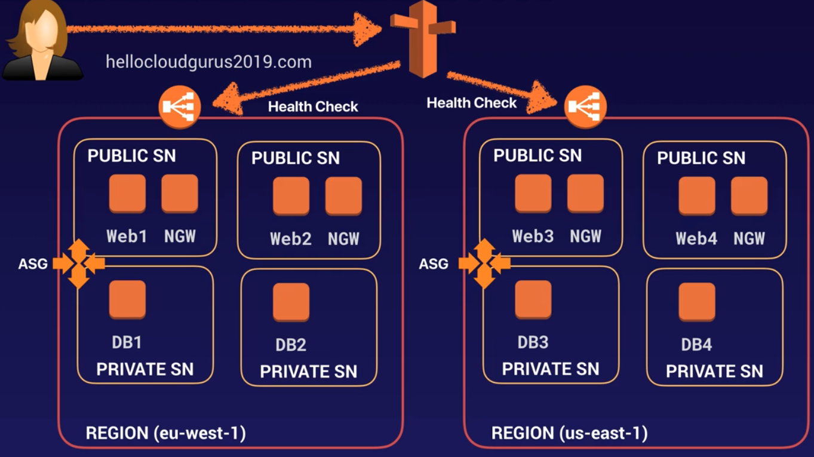
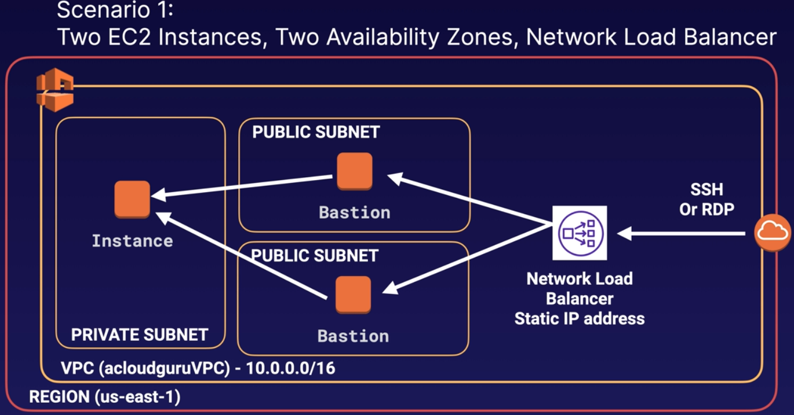
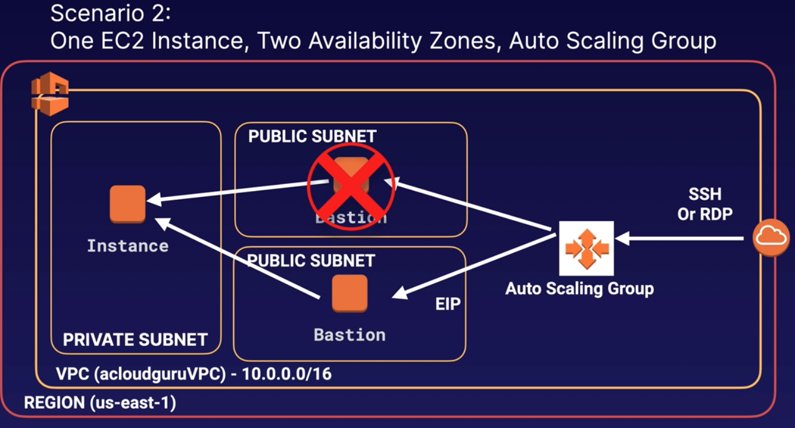

# HA Architecture

### Elastic Load Balancer (ELB)
- to balance load across web servers
- typically internet facing, but need not be
- **load balancers have DNS name, not IP address**
- **centralised management of SSL certificates**
- has one or more **listeners** to check incoming request
- **listeners are configured with protocol and port from client to ELB and vice-versa**
- 3 types - ALB, NLB, classic LB
    - **Application Load Balancer**
        - **balance http/https, TCP CANNOT BE USED**
        - **operates at layer 7**
        - application aware - based on things in the browser like language, currency it can route traffic to specific servers
        - advanced routing - send specific requests to specific web servers
        - **Spot instances cannot be used for ALB**
        - **is NOT charged based on no of AZs enabled**
    - **Network Load Balancer**
        - balance TCP traffic
        - **register targets in target groups and route traffic to target groups**
        - used for extreme performance
        - **operates at connection level (layer 4)**
        - handles millions of requests / sec with low latency
    - **Classic Loan Balancer**
        - **legacy Elastic Load Balancer**
        - **register instances against the LB directly**
        - uses round robin approach, cost-effective
        - **can balance http/https at layer 7**
        - uses layer 7 features like x-forwarded and sticky sessions
        - **can also balance TCP at layer 4**
        - **X-Forwarded-For Header**
            - holds the IP of the end user(external) instead of the ELB
            - can be useful to track client traffic
- **throws 504 (Gateway timeout) for app or db errors**
- **health checks are reported as InService or OutofService**
- **ELB never has IP, but only DNS name**

**Sticky Sessions**
- bind user's session to specific EC2 instance
- **can be enabled for ALB also, but traffic is sent at Target group level**
- disable sticky session if all traffic goes to same instance(s)
- **useful if you store data locally in the instance**

**Cross Zone Load Balancing**
- If LB is not cross zone, then ALB cannot send traffic across AZs
- if cross zone is enabled, the ALB can send traffic across AZs

**Path Patterns**
- routing based on path pattern in the URL
- e.g, images path can be routed to one AZ and rest of the path can be sent to other AZ
- **need to enable path pattern explicitly**

### Auto Scaling
- has 3 components
    - Groups - logical group of web servers, or app servers or db servers
    - Configuration template
        - groups uses a template to launch EC2 instances
        - can specify AMI id, instance type, key pair, security groups, block device mapping etc
    - Scaling options
        - dynamic scaling - when a condition is met, e.g CPU > 70%
        - schedule - scale out at specific time
- Scaling options - 5 types
    - **maintain current instance at all times**
        - maintain specified number of instances
        - if there is unhealthy instance, it is terminated and new one is launched
    - **scale manually**
        - manually specify max instance, min instances
        - AWS manages launching or termination of instances to maintain capacity
    - **scale based on schedule**
        - scale as function of date and time
        - used when scaling can be predicted
        - e.g maintain 10 instances on monday morning
    - **scale based on demand**
        - more advanced way to scale
        - **reactive scaling**
        - uses scaling policies
        - define policies based on conditions - e.g. launch if CPU > 50%
    - **predictive scaling**
        - uses EC2 auto scaling with AWS auto scaling
        - can combine dynamic and predictive scaling
        - **proactive scaling**

**Launch Templates (LT)**
- recommended over **Launch Configuration (LC)**
- LC is immutable, once created it cannot be edited, can only be replaced
- LT has latest features
- supports versioning - can deploy multiple versions, but 1 is set as default
- **can use T2 Unlimited burst feature**
- **allows provisioning both on-demand and spot instances**
- **is compatible to be used with AWS CLI and SDK**

### HA Architecture
- plan for failure
- user multi-AZ and multi region where possible

  

### Elastic Beanstalk
- simpler form of CloudWatch
- easy to use service to deploy and scale web apps
- just upload your code, beanstalk does deploying, load balancing, scaling, health check etc

### HA with Bastion hosts
- **Scenario 1**
    - costly as NLB is used
    - **NLB has to be used (not ALB) as Bastion host works in layer 4**
  

- **Scenario 2**
    - cheaper option
    - uses ASG, has fixed EIP
    - if host fails, ASG launches new host in another AZ
    - can use user data script to provision same EIP
    - **not 100% fault tolerant, as there is downtime to run the script**
  

### On-Premises Services with AWS
- **Database Migration Service**
    - move db from and to AWS
    - can be used when DR is on AWS and primary is on-prem
    - **supports homogenous (oracle -> oracle) migration**
    - **supports heterogenous (oracle -> postgres) migration**
- **Server Migration Service**
    - equivalent of DMS for servers
    - supports incremental replication from on-prem to AWS
    - can be used as backup tool, multi-site strategy
    - can be used as DR tool
- **AWS Application Discovery Service**
    - helps in migrating to AWS by collecting data from on-prem data centres
    - App discovery Agentless connector can be installed in on-prem
    - it creates a utilisation and dependency map of on-prem servers
    - data can be exported as csv to calculate ownership cost (TCO)
    - data is stored in AWS migration hub
    - this data can be used to migrate the discovered servers
- **VM Import/Export**
    - migrate existing applications to AWS
    - helps in creating DR strategy with AWS as DR or primary
    - **can also export AWS VMs to on-prem**
- **Download AWS Linux as ISO**
    - download and run it on-prem
    - supports VMWare, Hyper-V, KVM, VirtualBox(Oracle) etc

### CloudFormation
- way to script your entire cloud environment
- **supports two languages JSON and YAML**
- used to quick launch sites based on templates
- has lot of pre-defined templates to chose from
- in custom template, good practice is not to specify explicit resource names
- cloudformation converts logical resources to physical resources
- **updating existing resources in template is risky**
- **it DELETES existing resource and creates a new one**
- **has 2 main components - Stacks and Templates**
    - **Template** -
        - Template Format Version
        - Description
        - Metadata
        - Parameters
        - Mappings
        - Conditions
        - Resources (Required Field)
        - Outputs
    - **Stack** -
        - collection of resources
        - consists of one or more templates
        - advantage is that it is easy to create, delete or update the collection of resources
        - advanced stacks have a nested stack which holds a collection of stack
