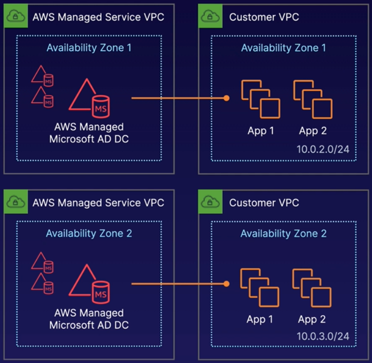

# Identity and Access Management - IAM

- allows to manage users and their level of access
- centralized control , shared access, granular permissions,
- identity federation (including active directory, facebook, linkedin etc)
- **multifactor authentication - advisable to set up on the root account**
- use google authenticator app for this
- supports PCI DSS compliance
  - Policy for password rotation
- **users**
    - permanent / long term - they have NO permissions when first created
    - new users are assigned access id and secret key - this is different from password
    - **cannot use access id and key to access console - used only for APIs and CLI**
- **roles**
    - assigned to users
    - **similar to users - both are attached to policies to control access**
    - do not have credentials associated with them
    - can be assumed by anyone who needs them
- **group** - set of users with common characteristics
- **policies**
    - permissions that an user/group can do
    - made up of policy documents in json format
- **ARN - Amazon resource number**
- password policy applies to all users - so to change policy for specific user(s), do it from either user level or group level
- **all IAM operations are done on global region (universal) and not one particular region**
- for non root user to access billing preferences, it has to be enabled - it can be enabled only from root account - explicitly enable billing access to IAM users
- to create an alarm, go to cloudwatch service and create a new alarm (send email if monthly charges > 5 USD)

#### AWS a/c details
- root account is the account created first with email - it has full admin access - god mode
```
     {
       "Version": "2012-10-17",
       "Statement": [
         {
           "Effect": "Allow",
           "Action": "*",
           "Resource": "*"
         }
       ]
     }
```
- The 'Effect' in the above json can be set to Deny
- **An explicit Deny always overrides any Allow that may be granted to the user in any other policy**
- **All permissions are implicitly denied unless explicitly granted**
- Console sign-in link: https://smalali.signin.aws.amazon.com/console

# Advanced IAM

### AWS Directory Service
- family of managed services
- connects AWS resources to on-prem Active Directory (AD)
- standalone directory in the cloud
- **use to integrate with existing AD based corporate credentials**
- **can SSO into any domain-joined EC2 instance**
- so if EC2 is integrated with AD, then you don't need to manage access separately
- **Active Directory** -
    - based on LDAP and DNS
    - supports Kerberos, LDAP, NTLM authentication
    - highly available
    - but huge overhead in managing it

### Microsoft compatible managed services
- #### AWS Managed Microsoft AD
    - is used to manage AD from AWS
    - provides AD domain controllers (DC) running windows server
    - **by default you get 2 DCs in different AZs for HA**
    - **reachable by apps in your VPC**
    - can add DCs in multiple AZs for HA
    - **only your account can access the DCs - so very secure**
    - **can extend existing AD to on-prem using *AD Trust***
    - works with MS SharePoint, SQL Server and .NET applications
    - supports Amazon WorkSpaces / WorkDocs / QuickSight / Chime / Connect
    - supports Amazon Relational Database Service for MSSQL / Oracle / PostgreSQL
    <br><br>
    - managing the AD is split between AWS and customer -
    <br><br>

- #### Simple AD
    - standalone directory for basic AD features
    - small: <= 500users, large <= 5000users
    - easier to manage EC2
    - can be used for Linux workloads that need AD
    - **does not support AD Trust, so cannot join on-prem AD**
    - supports user accounts, group memberships, joining a Linux domain
    - supports Windows based EC2 instances, Kerberos-based SSO, and group policies
    - provides monitoring, daily snapshots, and recovery
    - Compatible with Amazon WorkSpaces / WorkDocs / Quicksight / WorkMail
    - **Does not support MFA, Trust relationships, DNS dynamic update, schema extensions, communication over LDAPS, etc**
    - **Not compatible with RDS SQL Server**

- #### AD Connector
    - to connect on-prem AD to compatible AWS services
    - is a directory gateway (proxy) for on-prem AD
    - avoids caching information in cloud
    - **allows on-prem users to connect to AWS using AD**
    - can join existing EC2 instances to your existing AD domain
    - can scale across multiple AD connectors

### Web Identity Federation and Amazon Cognito
- #### Web identity federation
    - like signing into a website using facebook or google credentials
    - you can use the standard web identity providers like facebook or google to temporarily access aws resources

- #### Amazon Cognito
    - this is amazon's web identity federation provider
    - supports sign-in and sign-up and also guest users
    - acts as identity broker between application and web identity providers
    - no programmatic set up is required
    - **the temporary credentials provided maps to an IAM role that allows access to specific resources**
    - synchronizes user data from multiple devices
    - **recommended to be used with mobile devices**
    - **user pools**
        - **this is for authentication - user based**
        - user directories to manage sign up and sign in
        - when user logs in using facebook or google, cognito acts as identity broker
        - once authenticated, a JSON web token (JWTs) is generated
    - **identity pool**
        - used to provide temporary aws credentials to access to s3 or dynamodb
        - **this is for authorization - resource based**
    - **user synchronization**
        - cognito tracks the various devices an user is logged in
        - **when user changes his data, cognito pushes the update to all devices**
        - **uses SNS to send notification to all devices**


### NON Microsoft compatible managed services
- #### Cloud Directory
    - directory based store for developers
    - supports multiple hierarchies with millions of users
    - **use cases: org charts, course catalogs, device registries**
    - **fully managed service**

- #### Amazon Cognito User Pools
    - managed user directory for SAAS applications
    - supports sign in using web and mobile
    - works with social media identities
    - can use google, FB credentials to login to SAAS apps

### IAM Policies
- #### Amazon Resource Name (ARN)
<br><br>

- #### IAM role
    - **is both an IAM identity and resource that support resource based policies**
    - **instead of attaching to an user or group, it can be attached to anyone**
    - does not have any long-term credentials or keys associated with it
    - **when resources assume a role, it provides temporary creds only for that session**
    - used to access user, applications or services that do not have access to our resources
    - can attach one or more policies to a role
    - **e.g - role with full S3 access can be attached to EC2 to access S3 buckets**

- #### IAM Policies
    - json doc that defines permissions
    - **Identity policy**
        - attached to user, group or role
        - **2 types - AWS managed , custom managed**
    - **Resource policy**
        - attached to resources like S3, SQS etc
        - **only 1 type of resource policy - *Trust* policy**
        - **Trust policy is attached to an IAM role**
        - currently there are no AWS managed resource policies
    - **policy has no effect until attached to a identity or resource**
    - **not explicitly allowed = implicitly denied**
    - **explicit deny overrides all other policies**
    - **if multiple policies are attached, AWS does a *union* of all policies**
    - structured as list of statements
    - **each statement is an API request**
```
{
    "Version": "2012-10-17",
    "Statement": [
        {
            "Sid": "SpecificTable",        -- identifier
            "Effect": "Allow",             -- Allow or Deny
            "Action": [
                "dynamodb:BatchGet*",      -- <service name>:<action name>
                "dynamodb:DescribeStream",
                "dynamodb:DescribeTable",
                "dynamodb:Query",
                "dynamodb:Get*"
            ],
            "Resource": "arn:aws:dynamodb:*:*:table/MyTable"      -- resource
        },
        {
            "Effect": "Allow",
            "Action:" ["s3:ListBucket"],
            "Resource": ["arn:aws:s3:::test"]
        },
        {
            "Effect": "Allow",
            "Action": [
                "s3:PutObject",
                "s3:GetObject",
                "s3:DeleteObject"
            ],
            "Resource": ["arn:aws:s3:::test/*"]      -- wildcard applies to all objects
        }
    ]
}
```
    - **types of policies**
        - AWS managed - created by AWS, not editable
        - Customer managed - created by customer, editable
    - **inline policy**
        - **adhoc permissions attached to a specific identity**
        - is created directly within the role
        - cannot be associated with any other identity
        - like a private inner class accessible only by the role       


### Permission Boundaries
- delegate administration to other users
- supported for IAM entities - users or roles
- prevents privilege escalation or unnecessarily broad permissions
- controls the max permission IAM policy can grant
- **permissions boundary overrides the overall policy attached to IAM entity**
    - e.g - user1 is attached to 'AdministratorAccess' policy
    - but we set a permission boundary with the policy "AmazonDynamoDBFullAccess"
    - so user1 can actually only access dynamo db and nothing else
- use cases -
    - developers creating role for lambda functions
    - application owners creating role for EC2 instances
    - admin creating adhoc users

### AWS Resource Access Manager (RAM)
- Multi account strategy -
    - having separate accounts for billing, admin
    - helps in separating concerns
    - reduces blast radius in case of security vulnerabilities
    - but overhead in creating and sharing resources between accounts
- RAM is used to share resources between accounts
- prevents in creating duplicate resources
- resources can be shared between accounts under AWS organisation
- **when resource is shared from one account, it has to be accepted by the other account**
- AWS services that allow resource sharing -
<br><br>

### AWS Single Sign-On (SSO)
- centrally manage access to AWS accounts and business applications
- eg business apps - Atlassian, Dropbox, Github, Office365, Slack, Salesforce etc
- using aws SSO portal, you can login to aws account and business apps using corp credentials
- **SSO also integrates with any SAML 2.0 provides like Azure AD**
- **SAML - Security Assertion Markup Language**
    - allows user to login to app based on session in another context
    - e.g, you can use AD context and login to GSuite application
<br><br>

### Quiz tips
- Power user access allows - Access to all AWS services except the management of groups and users within IAM.
- To add new users to your account, - best practices are to create a custom sign-in link and also create new users with required permissions
