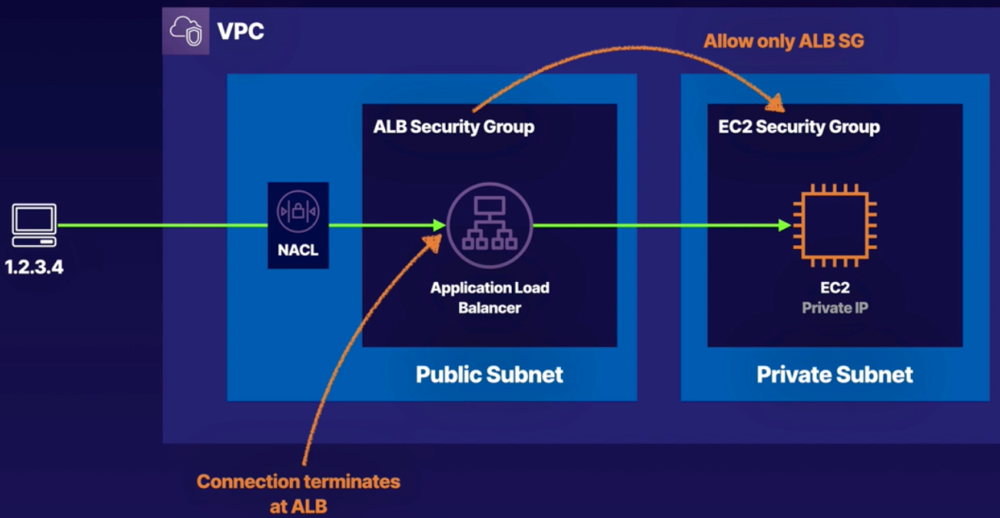
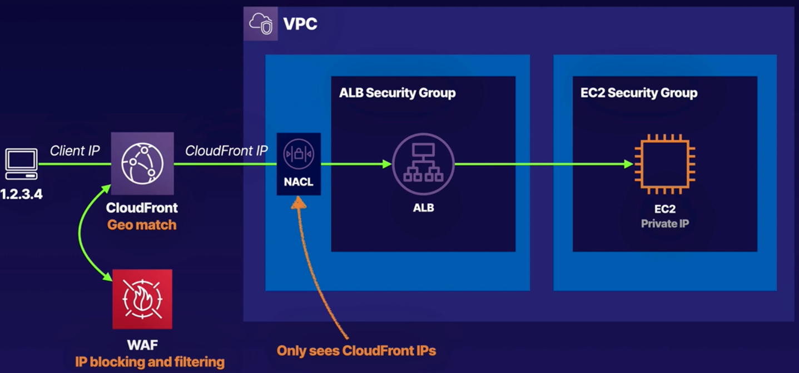
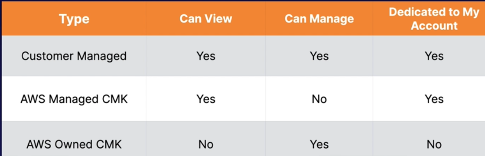
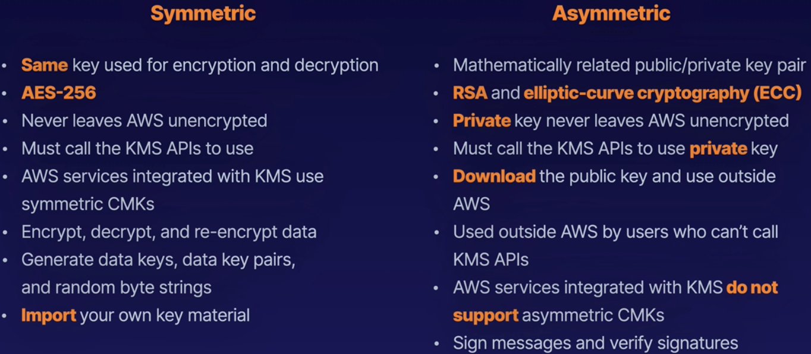
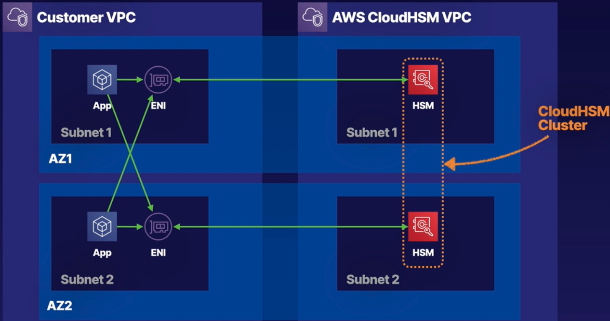
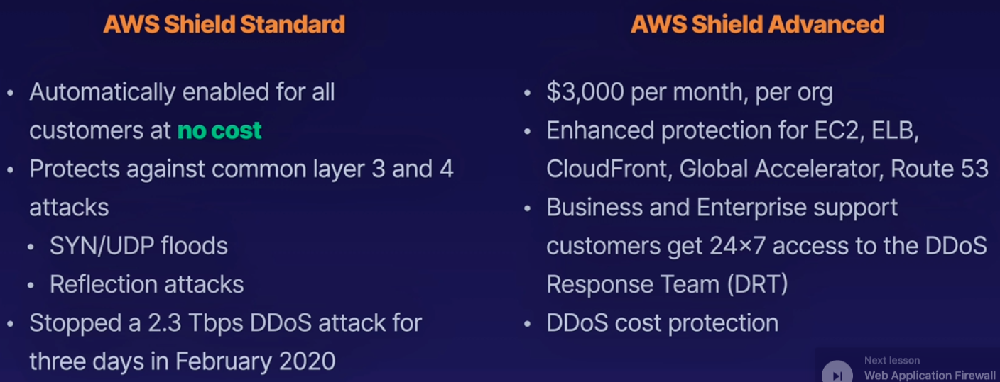
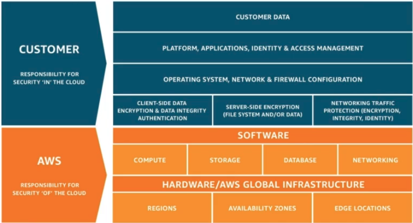

 # Security

### Reducing Security Threats
- identify bad actors - bad bots, content scrapers, fake user agent etc
- can use NACL to DENY specific IP
- create DENY rule to block bad IP(s)
```
INBOUND rule
100 - ALL TRAFFIC - 1.2.3.4 - DENY
200 - ALL TRAFFIC - 0.0.0.0/0 - ALLOW
```
- **can also protect EC2 instances directly using firewalld, iptables, ufw etc**
- if using ALB, bad connection can be terminated at ALB
- still need NACL to block bad IP at ALB itself
<br>
- but if we use NLB, traffic is not terminated at NLB, but can go to EC2
- **in case of NLB, NACL has to be used to terminate bad IP**
- other approach is **Web Application Firewall (WAF)**
    - **can be used to block origin IP, sql injection, xss forgery etc**
    - **operates at layer 7**
    - **preferred for public facing web apps**
    - **NACL operates at layer 4** - used to block IP ranges
- can also use **WAF + CloudFront**
    - here IP is terminated at CF, so ALB only sees CF IP
    - in this case, WAF can be used with CF to block bad traffic
    - **can also use CF geo match to block region based traffic**
    <br><br>

### Key Management Service (KMS)
- used for encryption / decryption
- **region specific**
- manages **Customer Managed Keys (CMKs)**
- can be used for encrypting S3 objects, db password, API keys etc
- can encrypt/decrypt till 4KB
- **pay per API call - encrypt, decrypt, re-encrypt etc**
- calls are audited using CloudTrail and stored in S3
- **compliant with FIPS 140-2 Level 2 standard**
- **compliant with CloudHSM level 3 standard**
- 3 types of CMKs -
    - **AWS managed CMK**
        - its free
        - **supports symmetric encryption (AES-256)**
        - **supports asymmetric encryption (RSA & ECC key pairs)**
        - available to any service in your account
        - AWS manages the keys
    - **Customer managed CMK**
        - fully managed by the customer
        - can be enabled / disabled
        - **customer has to managed key rotation**
    - **AWS Owned CMK**
        - its AWS internal keys
        - shared across multiple accounts
        - typically not visible as it is used internally
        - cannot used or audit these
    
- 2 types of encryption for CMKs
  
- **key policies**
    - **Default KMS policy**
        - when key is created, a default key policy is created
        - **policy grants full access to CMKs to the account root user**
        - **gives access to IAM policies to the KMS key**
    - **Custom KMS policy**
        - **define users, roles that can access the key**
        - **define who can administer the key**
        - **useful for cross-account access of the key**
        - a typical policy looks like this -
        ```
        {
            "Sid": "Allow use of the key",
            "Effect": "Allow",
            "Principal": {"AWS": "arn:aws:iam:111122223333:role/EncryptionApp"},
            "Action": [
                "kms:DescribeKey",
                "kms:GenerateDataKey*",
                "kms:Encrypt",
                "kms:ReEncrypt",
                "kms:Decrypt"
            ],
            "Resource": "*"
        }
        ```
- **when data is encrypted using CMK, it is also base64 encoded**
- **so before storing, it has to be decoded**
- when data is decrypted using CMK, it is also base64 encoded
- so it has to be decoded to get plain text
- **to encrypt/decrypt file > 4KB, use data encoded key (DEK)**
- in this case, both plaintext key and encrypted key(CipertextBlob) is generated
- ciphertextblob can be stored with the data and plaintext key can be destroyed
- **this is called Envelop encryption**
- **DEK is better for large size data as it does not send the actual data over network**

### CloudHSM
- HSM - Hardware Security Module
- **provide tamper resistant environment for managing encryption keys**
- is used when key needs validated control
- compliant with FIP 140-2 Level 3
- in CloudHSM, you can manage your own keys
- provides a single tenant multi AZ dedicated cluster to a customer
- **KMS also uses CloudHSM, but they are internally shared across customers**
- runs within a VPC in your account
- you don't have access to aws managed component
- **works with industry standard APIs, not AWS APIs**
- supports PKCS#11, JCE, Microsoft CryptoNG
  

### Systems Manager Parameter Store (SSM)
- securely managing config and secrets
- can also stored unencrypted data
- **it is serverless storage**
- values can be encrypted using KMS or plaintext
- helps separating config from code
- can also track versions of changes to the params
- can set TTL for secrets
- can store params in hierarchies
    - prod -> db -> mysql -> username  (or)
    - dev -> db -> mysql -> username
    - can assign permission to specific branches
    - can used GetParametersByPath API to retrieve params
    - e.g, /dev, /dev/db/mysql/username etc
- used in CloudFormation to create instances
```
Parameters:
    LatestAmiId:
        Type: 'AWS::SSM::Parameter::Value<AWS::EC2::Image::Id>'
        Default: '/aws/service/ami-amazon-linux-latest/amzn2-ami-hvm-x86_64-gp2'
Resources:
    Instance::
        Type: 'AWS::EC2::Instance'
        Properties: !Ref LatestAmiId
```

### AWS Secrets Manager
- used to rotate, manage and retrieve secrets like passwords etc
- similar to system manager parameter store
- charges per secret stored and per 10000 API calls
- **SSM is free and comes along with the account**
- **but secrets manager helps in secrets rotation automatically for RDS**
- **can generate random secrets**
- secrets manager can be shared across accounts

### AWS Shield
- protects against DDOS attack
- sits in edge of AWS peripheral network
  

### Web Application Firewall (WAF)
- monitors https traffic to CloudFront, ALB, API gateway
- control access to content based on rules
- configure filtering rules to allow/deny traffic based on :
    - IP address
    - query string params
    - sql query injection
    - blocked traffic returns 403
- allows 3 different behaviours
    - Allow all requests except ones specified
    - Deny all request except ones specified
    - Count the requests that match the properties specified
    - request properties that can be used for filtering:
        - origin IP address
        - origin country
        - request size
        - value in headers
        - regex patterns in string in request
        - SQL code injection
        - XSS
- **AWS Firewall Manager**
    - used to manage firewall rules
    - apply WAF rules on ALB, APIGateway, CF etc

### AWS Guard Duty
- **intelligent threat discovery to protect your account**
- **uses ML for anomaly detection**
- **input data can be :**
    - CloudTrail logs - unusual API calls, unauthorised deployments
    - VPC Flow logs - unusual internet traffic, unusual IP
    - DNS logs - compromised EC2 sending encoded data
- CloudWatch events can be set up to notify in case of violations
- can trigger lambda events or SNS notifications on violations
- **can protect against Crypto currency attacks**

### AWS Inspector
- **automated security assessment for *EC2 instances***
- check vulnerabilities on running EC2 instances
- **agent must be installed in EC2 instance**
- assessment report is generated with list of vulnerabilities
- can trigger SNS notifications after assessment
- **types of evaluation -**
    - **Network assessment** - agentless - tests network reachability
    - **Host assessment** - with agent - looks for -
        - common vulnerabilities
        - CIS benchmarks
        - security best practices

### Shared responsibility model
- Amazon responsible for **Security of the Cloud**
- Customer responsible for **Security in the Cloud**

