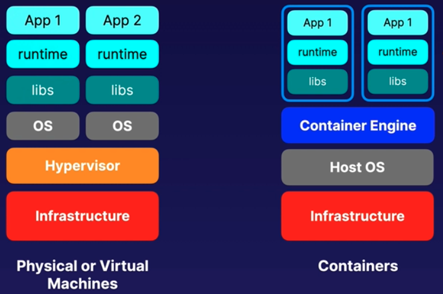

# Serverless

### Lambda
- abstraction layer
- compute service
- you can upload your code and create a lambda function
- lambda does provisioning and managing servers
- it also does patching, scaling etc
- **scales out automatically**
- can be used in the following ways -
    - **event-driven compute service**
        - runs your code in response to events
        - **1 event = 1 function**
        - e.g, changes to S3, dynamodb table etc
    - **compute service**
        - runs your code in response to http requests using API gateway
        - or API calls using AWS SDKs
- **one lambda function can trigger another lambda function**
- lambda can scale automatically
- it can spawn multiple ec2 instances to process many requests
- lambda supports - Node.js, java, python, C#, Go etc
- **pricing of lambda**
    - **based on number of requests**
        - first million requests is free
        - $0.20 per 1 million requests thereafter
    - **based on duration**
        - calculated from the time code starts executing till it returns
        - rounded to nearest 100ms
        - **price also depends on memory allocated to the function**
        - $0.00001667 perf GB used
- **AWS X-ray can be used to debug lambda functions**
- can be used to do things globally like back-up S3 to other S3 buckets
- **RDS, EC2 ARE NOT serverless**
- **Aurora serverless, Dynamodb, S3, API gateway ARE serverless**
- traditional vs serverless architecture
  
- **Lambda event sources that can trigger the lambda function**
- **Synchronous (direct) triggers - ALB, Cognito, Lex, Alexa, API Gateway, CloudFront, Kinesis Data Firehose**
- **Asynchronous triggers - S3**

### Serverless Application Model (SAM)
- Cloudformation extension optimised for serverless apps
- supports anything that CF supports
- has new resources types like functions, APIs, dynamodb tables etc
- can run serverless app locally in a docker container - helps in developing/debugging
- package and deploy using Codedeploy

### Elastic Container Service (ECS)
- VM and Containers -
  
- **managed containerisation orchestration service to run and scale containerised apps**
- uses clusters to manage fleet of container deployment
- **build apps with dockers and deploy to ec2 or fargate instances**
- ecs manages the cluster and takes care of scheduling, monitoring the cluster
- places containers optimally inside your cluster
- can define CPU, memory utilisation rules and cluster will monitor them
- **can also help in placement of containers based on rules**
- can run different types of apps or tasks across the cluster - like apps, intermittent job
- shows resource utilisation per app
- can quickly deploy, update, rollback containers
- **integrates with VPC, security groups, EBS, ELB, CloudWatch, CloudTrail**
- **scheduling/monitoring/orchestration is free, but instances that are spun up are charged**
    
- ECS components
    - **Cluster**
        - logical collection of ECS resources
        - either ec2 or fargate instances
    - **Task definition**
        - defines the application
        - like a docker-compose file, but for ECS
        - **can define multiple containers that need to run together**
    - **Container definition**
        - **runs within a task definition**
        - defines individual containers that make up the task
        - **can specific CPU/memory allocations, port mapping per container**
        - like a docker file
    - **Task**
        - **single running copy of a container defined in a task definition**
        - one working copy of an app
        - **e.g., web container and db run as 2 different tasks**
    - **Service**
        - scales task definitions by adding tasks
        - can define minimum and maximum no. of tasks
        - **depending on auto scaling rules, tasks will vary between min and max values**
    - **Registry**
        - storage for container images
        - can be **Elastic Container Registry (ECR)** or docker hub
    - 

### Fargate
- serverless compute engine for containers
- works with ECS and EKS
- eliminates need to provision and manage servers
- pay for resources application
- **provisions resources automatically, so no need to manually select resources and scale**
- prevents over allocation of resources
- **runs each task in its own kernel, so provides isolation and security**
- **EC2 should be chosen if** -
    - need customisation of resources as you cannot access fargate instances
    - compliance requirements
    - required access to GPU

### Elastic Kubernetes Service (EKS)
- **Kubernetes (k8s) is open source software to deploy and manage containers at scale**
- **same toolset for both on-prem and cloud**
- containers are grouped in **pods**
- works with ECS and fargate
- **choose EKS if you want to migrate workloads to AWS**

### Elastic Container Registry (ECR)
- managed dockeer container registry in AWS
- store and deploy and manage images
- integrates with ECS and EKS
- can work with on-prem deployments
- highly available
- **integrates with IAM, so access can be controlled through policies**
- **pay for storage and data transfer - similar to S3**

### ECS and ELB
- ECS can be integrated with ELB for traffic distribution on cluster instances
- **supports ALB (layer 7), NLB (layer 4), CLB (layer 4)**
- integrates with EC2 and fargate instances
- ALB allows
    - dynamic port mapping - same task can run multiple times in an instance using different ports
    - path based routing
    - priority rules based traffic control
    - **ALB is preferred over NLB/CLB**
    - 

### ECS Security
- **EC2 Instance role**
    - role is assigned to the whole instance
    - so policy is applied to all tasks running in that instance
    - course grained
- **Task role**
    - granular control / fine grained
    - policy is applied on per task basis
    - so a separate role can be created for each task
    - e.g. Task A -> Role A -> access S3
    - Task B -> Role B -> access S3 + dynamodb
  
