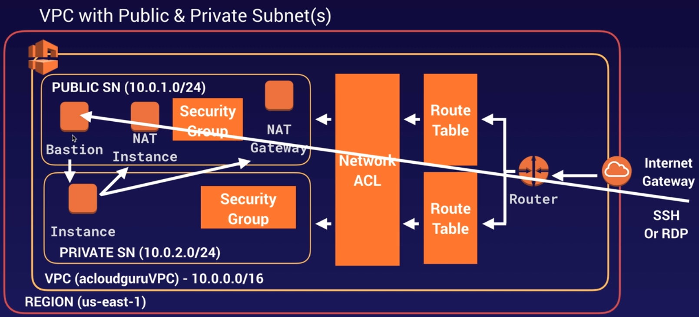
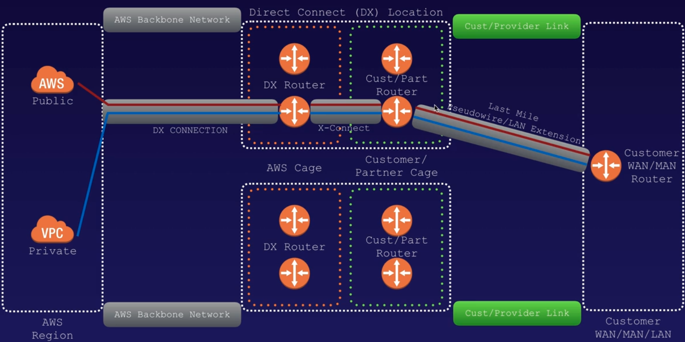
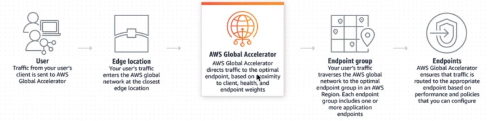
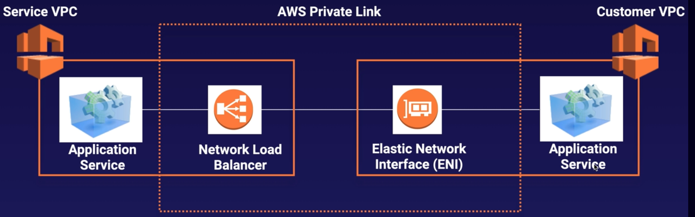
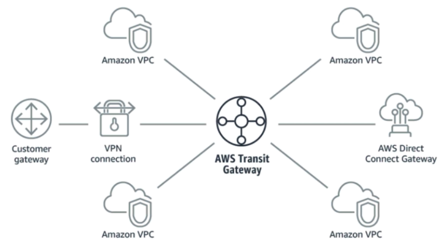
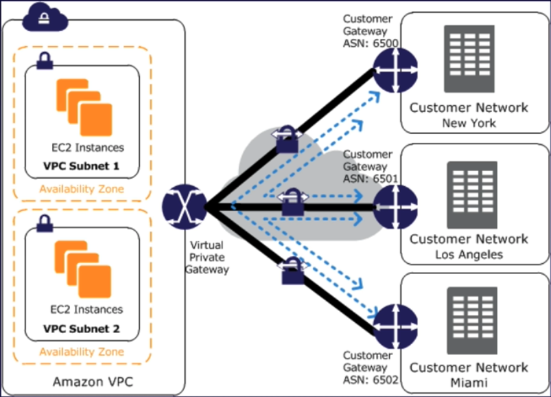

# Virtual Private Cloud - VPC

- consists of
    - internet gateways (Virtual Private Gateways)
    - route tables
    - network ACLs
    - subnets
    - security groups


- **1 subnet = 1 availability zone**
- **allows 5 VPCs to be created per region per account, beyond that need AWS support**
- **subnets cannot span across AZs, but 1 AZ can have >1 subnet**
- **public subnets has public IP only if auto-assigned, it is not set by default**
- logically isolated section of AWS cloud
- can select own IP address range, create subnets
- configure route tables
- configure network gateways
- customize your network config - e.g, webservers can be placed in public facing subnet
- db servers can be placed in private subnet
- leverage security groups, network ACL (NACL)
- **security groups are stateful, network ACLs are stateless**
- **stateless - need to explicitly add inbound and outbound rules, adding one does not add another automatically**
- create hardware VPN between corporate data center and VPC
- use **https://cidr.xyz/** to find number of IPs available
- **a barebone new VPC consists of route table, NACL, security group**
- **ec2 instances in new subnet can connect to each other across AZs**
- **an internet gateway can be attached to only one VPC**
- **egress-only gateway allows IPv6 access to internet, but denies connection into VPC**
- **AWS reserves 5 IP addresses to itself when a subnet is created**
- The AZs are randomised - same region in 1 account can be in a different AZ from another account
- **you can conduct PEN test for up to 8 services, beyond that need AWS authorisation**

<br><br>

### Default vs Custom VPC
- default vpc allows you to deploy ec2 instances immediately
- in default vpc, all subnets have route to internet
- in default vpc, ec2 instance has both public and private IP
- can recover default VPC, if deleted
- **custom VPC public IP is lost when restarted**

### Security Groups
- evaluates all rules before deciding to allow traffic
- **supports ALLOW only rules**
- DENY rule is implicit
- **operates at the instance level**
- are associated with ENI
- **security groups cannot span across VPCs**
- **default SG has a default rule to allow all traffic, all protocols, all ports**

### VPC Peering
- allows connecting one VPC to another directly using private IPs via direct network route
- can peer VPCs in same as well as different accounts
- **can peer between regions as well**
- **peering is in a star configuration**
- **no transitive peering**
- **cannot be used to peer from VPC to on-prem - use Transit gateway**

### NAT instances and NAT gateway
- NAT - Network Address Translation
- **used to connect ec2 instances in private subnets to the internet**
- generally used to run updates of software etc
- **NAT instances**
    - single ec2 instance used to connect to the internet
    - not used much - on their way out
    - cannot scale out if many instances uses this as NAT instance
    - **specific NAT ami's available**
    - **launched in the public subnet**
    - **does not support IPv6**
    - **source/destination check for the instance should be disabled**
    - **new route should be added in the route table of the private subnet**
    - **always behind a security group**
    - scaling NAT instance is manual - autoscaling groups, automate failover etc
    - manually patch the instance
    - e.g of metric filter pattern to create ssh reject logs filter when creating an alarm -
    > `[version, account, eni, source, destination, srcport, destport="22", protocol="6", packets, bytes, windowstart, windowend, action="REJECT", flowlogstatus]`


- **NAT gateways**
    - multiple instances spread across multiple AZs
    - highly available - automatic failover
    - is launched in the public subnet
    - **new route should be added in the route table**
    - **only one gateway in a AZ**
    - 5 GBps to 45 GBps
    - **does not support IPv6**
    - **always created in the PUBLIC subnet**
    - not behind a security group
    - no manual patching
    - automatically assigned public IP address
    - no need to disable source/destination check
    - **create gateway in each AZ so that instances in that AZ use that gateway**
    - **usage is charged in hourly basis**

### Network Access Control List (NACL)
- a default NACL is created by default when vpc is created
- **operates at the subnet level unlike security groups**
- **default NACL has all inbound/outbound rules as ALLOW**
- **but a custom NACL has a DENY on all traffic by default**
- need to explicitly add inbound and outbound rules - stateless
- rules are evaluated in rule id order (chronological)
- **so to restrict traffic, deny rules should be before allow rules**
- add inbound/outbound rules for ephemeral port to allow updates
- **NACL rules are always evaluated before security groups**
- **always use NACLs to block specific IPs and not security groups**
- **1 NACL can have multiple subnets, but 1 subnet can have only one NACL**
- **each subnet in the VPC should be associated with NACL, else it goes to default NACL**

### VPC FLow Logs
- enables you to capture IP traffic in your VPC
- **logs are captured in CloudWatch or S3 bucket**
- can be created at 3 levels
    - VPC
    - subnet
    - ENI
- **new CloudWatch log group and new IAM role has to be created before setting up**
- **cannot enable logs for peered VPCs unless they are in the same account**
- flow logs can be tagged
- cannot change flow log config after creation - e.g., cannot change IAM role (unlike EC2)
- **IP traffic is NOT monitored -**
    - when contacting amazon DNS, but own DNS server traffic is monitored
    - Windows license activation traffic
    - traffic to and from metadata instance - 169.254.169.254
    - DHCP traffic
    - traffic to reserved IP in VPC

### Bastion hosts
- special computer designed to withstand attacks
- normally hosts single application like proxy server
- done to reduce threat
- **located outside firewall or in a DMZ**
- usually accessed from untrusted network
- used to securely administer EC2 instances using ssh or rdp
- **also called Jump Boxes**
- **NAT gateways cannot be used as Bastion host**

### Direct Connect
- **used to have dedicated connection from on-prem to AWS**
- reduce cost, increase throughput
- more stable than internet based connections
- **steps to create DX**
    - create virtual interface in DX console - this is a PUBLIC virtual interface
    - Goto VPC console -> VPN connection -> create Customer gateway
    - Create Virtual Private gateway
    - Attach virtual private gateway to VPC
    - Goto VPN Connections -> Create new VPN connection
    - Select the virtual private gateway and customer gateway
    - after vpn is ready, set up VPN on customer gateway or firewall

<br><br>

### Global Accelerator
- service to improve availability and performance of applications
- accelerator directs traffic to optimal endpoints over AWS global network
- gives 2 static IP address
- you can bring your own IP



- includes the following components
    - **IP address**
        - provides 2 static IP or bring your own
    - **Accelerator**
        - to direct traffic optimally over AWS network
        - includes 1 or more listeners
    - **DNS**
        - each accelerator is assigned a DNS name
        - **e.g - abcd1234.awsglobalaccelerator.com**
        - DNS points to static IP
        - either DNS name or static IP can be used to route traffic
        - can also set up DNS record to route traffic to custom domain
    - **Network zone**
        - services the static IP from a unique IP subnet
        - **same as AZ, but for network**
        - if 1 of the 2 static IP is blocked by client network, the other IP can be used
    - **Listener**
        - processes inbound traffic form client to global accelerator
        - supports TCP and UDP
        - associated with one or more endpoint groups
        - **listener is associated with endpoint groups through regions**
        - traffic is distributed to endpoints within the group
    - **Endpoint group**
        - associated with Region
        - include one or more endpoints in that region
        - **increase or decrease traffic to the group by adjusting a setting called traffic dial**
        - helps in perf testing of group or blue/green deployment testing
    - **Endpoint**
        - can be network load balancer, application load balancer, EC2 instance, elastic IP
        - ALB can be internet or internal facing
        - **traffic is routed based on endpoint weights**
        - weights are proportion of traffic to route to each endpoint
        - can be used to perf test inside a region

### VPC Endpoints
- endpoints are virtual devices
- horizontally scaled, highly available
- **enables direct connection from VPC to supported services and endpoints**
- powered by PrivateLink
- no need for internet gateway, NAT instance, Direct Connect, VPN etc to connect
- **instances in VPC do not need public IP to connect to resources in the service**
- **traffic between VPC and other service does not leave Amazon network**
- **when using VPC endpoint, source IP address will be private and not public**
- 2 types of endpoints
    - **Interface endpoints**
        - is an ENI with private IP
        - is an entry point for supported service
        - services supported e.g
            - CloudFormation, CloudWatch, Kinesis, Secrets Manager
            - EC2 API, ELB API, SNS, SQS, Security Token Service
    - **Gateway endpoints**
        - similar to NAT gateways
        - support only for S3 and DynamoDB
        - **is a free service**

### Private Link
- opens one or more specific services in one VPC to another
- **cannot use VPC Peering because -**
    - create seperate peering relationships for each connection
    - whole network will be accessible, not good if you have multiple apps in VPC
- **can expose services to 10s or 100s of clients**
- no need for peering, gateways, route tables, NAT gateways etc
- **requires NLB on service VPC and ENI on customer VPC**
- **to create private link, take the NLB static IP and open it up in the ENI**

<br><br>

### Transit Gateway
- was introduced to simplify complex network architecture
- **acts as a hub to which spokes like VPNs, VPC peering etc can connect**
- **allows transitive peering between 1000s of VPCs to on-prem**
- **usually set up at region level, but can be multi-region also**
- **can be used across multiple AWS accounts using RAM (Resource Access Manager)**
- uses route tables to limit how VPCs talk to each other
- works with Direct Connect and VPNs
- **with VPC peering and transit gateway, data is encrypted and never uses internet**
- **supports IP multicast - the only AWS service to support multicast**

<br><br>

### VPN CloudHub
- a new service
- **if there are multiple sites with its own VPN, CloudHub can be used to connect them**
- hub and spoke model
- hub has a virtual private gateway which is the cloud hub
- low cost
- operates over internet
- still secure as traffic between customer gateway and cloud hub is encrypted

<br><br>

### AWS Network Costs
- use private IPs when possible - it utilizes AWS network
- to cut all network costs, group all EC2 instances in same AZ and use private IPs
- but in this case, there is single point of failure - if AZ goes down, then app goes down

### STEPS TO CREATE VPC AND ASSOCIATED COMPONENTS
- Create new VPC - vpc1
- CIDR block - 172.16.0.0/16
- create internet gateway - igw1
- attach igw1 to vpc1
- create public subnet in US-east-1a - public1
- CIDR range - 172.16.1.0/24
- create pprivate subnet in US-east-1b - private1
- CIDR range - 172.16.2.0/24
- create public route table - publicrt
- edit route - select igw1 for CIDR 0.0.0.0/0
- edit subnet associated - select public1
- create private route table - privatert
- edit subnet associated - select private1
- create public nacl - public_nacl
- add inbound ALLOW rules ssh, http for CIDR 0.0.0.0/0
- add outbound ALLOW rules for custom tcp, ports 1024-65535
- edit subnet associate - select public1
- create private nacl - private_nacl
- add inbound ALLOW rule - ssh for CIDR 172.16.1.0/24 (public subnet)
- edit subnet associated - select private1

> ```  
- public subnet -> public route table -> internet gateway
- private subnet -> private route table -> NAT gateway
- NAT gateway (with Elastic IP) -> in Public subnet
```
